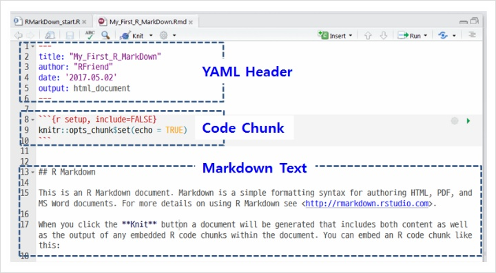
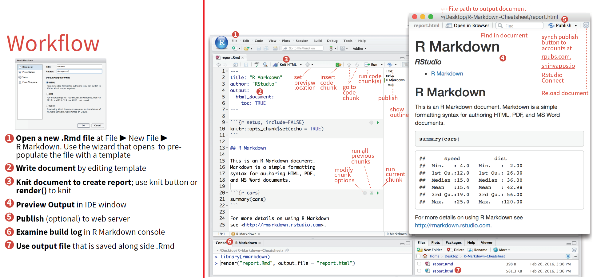

```{r setup, include=FALSE}
knitr::opts_chunk$set(echo = FALSE)
```

```{r, include=FALSE}
library("pacman")
p_load(rmarkdown, knitr, dplyr, ggplot2, tidyverse)
```

## Table of Contents

1. Workflow
2. Open file
   + Components of R Markdown
3. Choose Output
4. Embed Code
5. Markdown
6. Render

## 1) Workflow
- R Markdown (Rmd) is a format for writing reproducible, dynamic reports with R. 
- Use it to embed R code and results into slideshows, pdfs, html documents, Word files and more. 
- To make a report:

```{r, out.width='100%', fig.align='center'}
knitr::include_graphics('workflow.png')
```

## 2) Open File
- Start by saving a text file with the extension .Rmd, or open an RStudio Rmd template

```{r, out.width='100%', fig.align='center'}
knitr::include_graphics('openfile.png')
```

## * Components of R Markdwon

```{r, out.width='100%', fig.align='center'}

```

## 3) Choose output [YAML Header]
- YAML (**Y**et **A**nother **M**arkup **L**anguage)
- Write a YAML header that explains what type of document to build from your R Markdown file

```{r, out.width='90%', fig.align='center'}
knitr::include_graphics('output.png')
```

## 4) Embed Code
- Use knitr syntax to embed R code into your report

```{r, out.width='70%', fig.align='center'}
knitr::include_graphics('embedcode.png')
```

## 5) Markdown
- Use markdown syntax to describe how to format text in the final report

```{r, out.width='90%', fig.align='center'}
knitr::include_graphics('markdown1.png')
```

## 5) Markdown

```{r, out.width='100%', fig.align='center'}
knitr::include_graphics('markdown2.png')
```

## 5) Markdown

```{r, out.width='70%', fig.align='center'}
knitr::include_graphics('markdown3.png')
```

- [Math & Equations](https://www.latex-tutorial.com/tutorials/amsmath/)

## 6) Render
- Use your .Rmd file as a blueprint to build a finished report

```{r, out.width='100%', fig.align='center'}
knitr::include_graphics('render.png')
```

## Summary

```{r, out.width='105%', fig.align='center'}

```

## Resources

- [R Markdown](https://rmarkdown.rstudio.com/)
- [R Markdown: The Definitive Guide](https://bookdown.org/yihui/rmarkdown/)
- [R Markdown Cheat Sheet 1](https://rmarkdown.rstudio.com/lesson-15.html)
- [R Markdown Cheat Sheet 2](https://rstudio.com/wp-content/uploads/2015/02/rmarkdown-cheatsheet.pdf)
