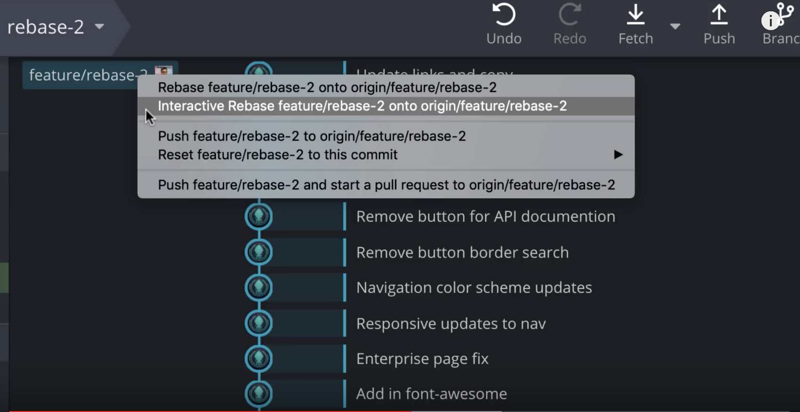

```{r setup, include=FALSE}
knitr::opts_chunk$set(echo = FALSE)
```

## Download for free

```{r, out.width='100%', fig.align='center'}
knitr::include_graphics('G21.jpg')
```
Source: Google

## Main page

```{r, out.width='100%', fig.align='center'}

```

Source: Youtube Gitkraken Tutorial

## Create a repo on Gitkraken

```{r, out.width='100%', fig.align='center'}

```

Source: Youtube Gitkraken Tutorial

## Initialize the repo

```{r, out.width='100%', fig.align='center'}

```

Source: Youtube Gitkraken Tutorial

## Edit the file

```{r, out.width='100%', fig.align='center'}

```

Source: Youtube Gitkraken Tutorial

## Save the changes

```{r, out.width='100%', fig.align='center'}

```

Source: Youtube Gitkraken Tutorial

## Stage the files and commit the changes 

```{r, out.width='100%', fig.align='center'}

```

Source: Youtube Gitkraken Tutorial

##  Pull and push the commits

```{r, out.width='100%', fig.align='center'}

```

Source: Youtube Gitkraken Tutorial

##  Filter the commits

```{r, out.width='100%', fig.align='center'}

```

Source: Youtube Gitkraken Tutorial

##  Compare the changes

```{r, out.width='100%', fig.align='center'}

```

Source: Youtube Gitkraken Tutorial

##  Create a new branch

```{r, out.width='100%', fig.align='center'}

```

Source: Youtube Gitkraken Tutorial

##  Merge to master branch

```{r, out.width='100%', fig.align='center'}

```

Source: Youtube Gitkraken Tutorial

##  Make a pull request and push to remote

```{r, out.width='100%', fig.align='center'}

```

Source: Youtube Gitkraken Tutorial

##  Pull and Fretch from the remote to local

```{r, out.width='100%', fig.align='center'}

```

Source: Youtube Gitkraken Tutorial

##  Rebase

```{r, out.width='100%', fig.align='center'}

```

Source: Youtube Gitkraken Tutorial

##  Rebase

```{r, out.width='100%', fig.align='center'}

```

Source: Youtube Gitkraken Tutorial

##  Made a mistake?

```{r, out.width='100%', fig.align='center'}

```

Source: Youtube Gitkraken Tutorial

##  Gitkraken Glo--task tracking

```{r, out.width='100%', fig.align='center'}

```

Source: Youtube Gitkraken Tutorial

##  Github and Gitkraken

```{r, out.width='100%', fig.align='center'}

```

Source: Youtube Gitkraken Tutorial

##  Illustrate in class

```{r, out.width='100%', fig.align='center'}

```

Source: Youtube Gitkraken Tutorial

##  More info about Gitkraken

- [Youtube Tutorial](https://www.youtube.com/channel/UCp06FAzrFalo3txskS1gCfA)
- [Gitkraken Website](https://www.gitkraken.com}{Official website)


