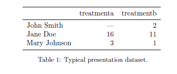
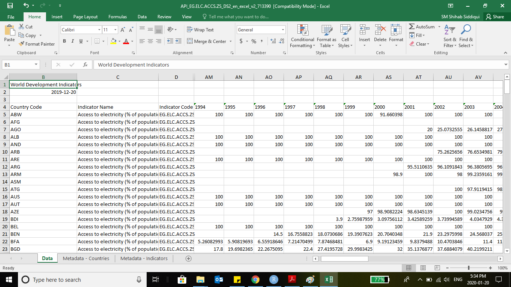
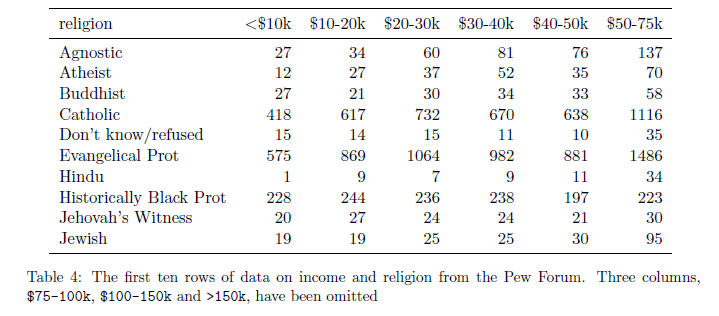
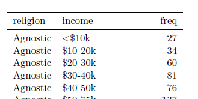
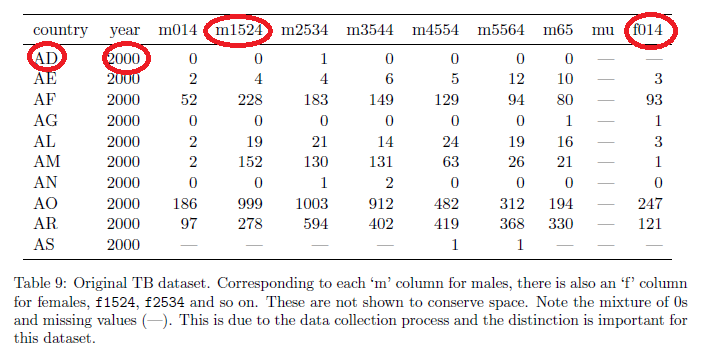
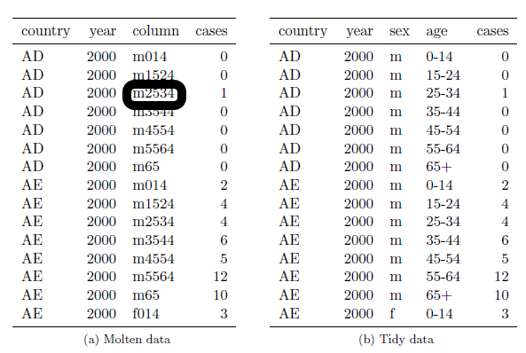
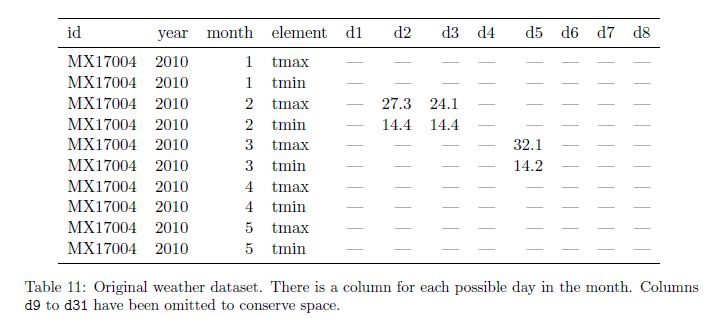
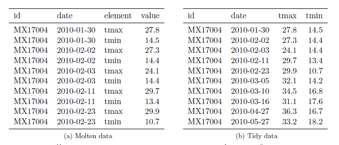

```{r setup, include=FALSE}
knitr::opts_chunk$set(echo = FALSE)
```

## Introduction

 - 80% of data analysis is spent on the process of cleaning and preparing
the data (Dasu and Johnson 2003)

- Generally done over the course of analysis, as new data is presented

- Our focus is on **DATA TIDYING:** structuring of datasets

- Based on [Tidy Data by Hadley Wickham](https://vita.had.co.nz/papers/tidy-data.pdf)


*Happy families are all alike; every unhappy family is unhappy in its own
way*

*~Leo Tolstoy*

## Semantics

- A **dataset** is a collection of **values**. Every value belongs to a variable and an obersavation
- A **variable** contains all values that measure the **same underlying attribute**
- An **observation** contains all values measured on the **same unit**
- Most statistical datasets are rectangular tables made up of rows and columns.
```{r, out.width='60%', fig.align='center'}

```

## How should Tidy Data look ?

- Each column should represent a variable. So we can talk about relationship between columns
- Each row should represent an observation. So, we can compare values in columns across rows
- Each observational unit forms a table

An example of a bad way to represent data ? World Bank Data

```{r, out.width='60%', fig.align='center'}

```

## Frequent features of untidy data

- Column headers are values, not variable names.
- Multiple variables are stored in one column.
- Variables are stored in both rows and columns.
- Multiple types of observational units are stored in the same table.
- A single observational unit is stored in multiple tables.

Wickman thinks that most messy data can be tidied up using these simple steps:
- melting, string splitting, and casting

## Column headers are values

```{r, out.width='50%', fig.align='center'}

```
Note that a complete description of an observation should say something like "Agnostics in income group $30-40K". In these cases we should **melt** the data - i.e. restack the data.

```{r, out.width='50%', fig.align='center'}

```

## Multiple variables in one column

```{r, out.width='40%', fig.align='center'}

```
This is shows data on Tuberculosis prevelance. Just melting creates columns documenting both gender and age (left panel). So, split the data for tidy representation (right panel).
```{r, out.width='40%', fig.align='center'}

```
Compare the ease of calculating rates.

## Variables in rows and columns

```{r, out.width='55%', fig.align='center'}

```

First melt the data using id and date, then cast (unstack) to create two variables tmax and tmin.

```{r, out.width='55%', fig.align='center'}

```

## Multiple types of observational units are stored in the same table.

We could split the billboard data presented above to its more granular level. But this may be less important.

```{r, out.width='80%', fig.align='center'}

```

## A single observational unit is stored in multiple tables.

- First put each observation types in a single table
- Then tidy further
- Use [plyr](https://cran.r-project.org/web/packages/plyr/plyr.pdf) package in R

Examples are varied and complex. Examples inlude:

https://github.com/hadley/data-baby-names
https://github.com/hadley/data-fuel-economy

## Tidy Tools

- Tidy Tools produce tidy outputs, making it easier to compose key manipulations such as Filtering, Transformation, Aggregation and Sorting
- In R, both filtering and transforming subset() and transform() are output-tidy
- plyr package provides tidy summarise() and arrange(), and ddply() from plyr is a tidy alternative to by() of R.

Useful resources

[Hadley Wickham`s paper](https://vita.had.co.nz/papers/tidy-data.pdf)

[plyr in R](https://cran.r-project.org/web/packages/plyr/plyr.pdf)

##
```{r, out.width='50%', fig.align='center'}

```
