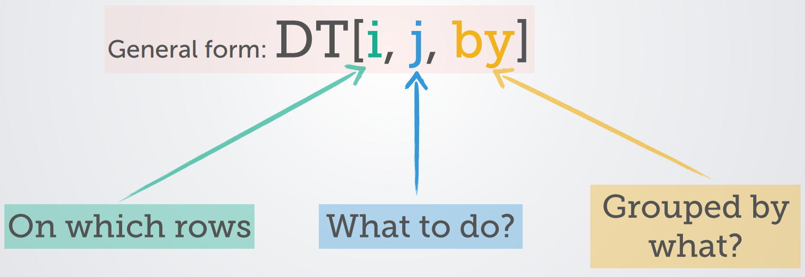

```{r setup, include=FALSE}
library(pacman)
p_load(knitr,tidyverse, data.table, dtplyr, dplyr, hrbrthemes,xaringan)

opts_chunk$set(
  fig.align="center",  
  fig.height=4, #fig.width=6,
  out.length="520.75px",
  
  dpi=300, #fig.path='Figs/',
  cache=TRUE,
  echo = FALSE
)

```

# What is data.table?

Data.table is a package centered around the data.table object. 

- data.tables are data.frames upgraded with extra functionality to make data wrangling a breeze.

--
Compared to using data.frames, working with data in data.tables is:

 - Concise
  
 - Fast
 
 - Consistent
---
# The Verbosity of the Tidyverse

When using the Tidyverse to organize or manipulate a dataset, one has to go step-by-step. 
--

</br>

Ex: Recall the starwars dataset from our last lecture. 

--

- We might ask: what is the average height of humans on each homeworld, by gender?
--
- Using the tidyverse, we have to break that question into a few steps
--
```{r echo=TRUE}
starwars %>% 
  filter(species=="Human") %>% 
  group_by(homeworld, gender) %>% 
  summarise(mean_height=mean(height, na.rm=T)) %>% head(4)
```

---
# Wrangling a data.table
What the tidyverse does one operation at a time, data.table does with one concise expression.

- Even better, that expression (almost) always fits into the same structure.

--

</br>

```{r, out.width='100%', fig.align='center'}

```
---

# The Big Idea
```{r, out.width='100%', fig.align='center'}

```

</br>

To manipulate a data.table, all you do is:
--
1. Tell R the data.table's name
--
2. Tell R the end product that you want to see. 
</br>

--

With data.tables we we can frequently write out command as a single, fluid thought.
---

# A Quick Example

Let's take our starwars question:
>what is the average height of humans on each homeworld, by gender?
--

With data.table
```{r echo=TRUE, R.options=list(max.print=20)}
starwars_dt=as.data.table(starwars)

starwars_dt[species=="Human", mean(height, na.rm=T), by=.(homeworld, gender)]

```

--

</br>

using data.tables, most types of data wrangling can be done within this simple framework.
---
# DT[i,]- Filtering

data.table's filter works much like dplyr's: 


</br>

--
- `data_table[var1=="string",]`: Grab all the rows where var1="string"

--
- `data_table[var2 > 5,]`: Grab all rows where var2 is greater than 5

--
- `data_table[1:10,]`: Grab the first 10 rows
--

data.table can handle multiple filters at once, too:

`data_table[var1=="string" & var2>5,]`: Grab all rows where var1="string" and var2 is a number greater than 5
</br>

--
One Difference: </br>
--
Since we start off by telling R what data.table to look at, we can call variables without using `$`
---
# DT[,j]- Manipulating

With dplyr, we need to use different verbs to do manipulate our variables in different ways:

- `select()`
- `mutate()`
- `summarise()`
- `count()`

--

</br>

data.table recognizes that all of these verbs are just different versions of telling R: 
>'*do something to this variable in my dataset*'
--

data.table let's you do all of those operations in one place: the `j` argument.

---
# DT[,j]- Making Changes to Data
To add, delete, or change a column in a dataframe, we use the syntax `:=`  
</br>
--
To add a new column:
```{r, eval=F, echo=T}
DT[,newvariable:=variable1+500]
```
--
To change an existing column:
```{r, eval=F, echo=T}
DT[,newvariable:=as.numeric(newvariable)]
```
--
To make multiple changes at once:
```{r, eval=F, echo=T}
DT[,':='(p_values_correct=p_values*.01, p_values= NULL)]
```

---
# DT[,j]- Extracting Columns
We can extract columns from our data using `j` too. 
--

By column index:
```{r, eval=T, echo=T, R.options=list(max.print=1)}
starwars_dt[,c(1)]
```

--
Or by name:
--
```{r, eval=T, echo=T, R.options=list(max.print=2)}
starwars_dt[,.(name, homeworld)]
```


--
What's with the `.()`?

- It's just data.frame's codeword for a list. 
---
# DT[,j]- Summarizing

Finally, we can do summary manipulations in `j`
```{r, eval=T, echo=T}
mean_height=starwars_dt[,mean(height, na.rm=T)]
mean_height
```

--

Without the `:=` syntax, we don't keep anything unless we specify it. 
---
# DT[, ,by]- Grouping by

The third argument of the data.table command lets us group by, just as with `group_by`.


--
We can group by a single variable:
--

```{r, eval=T, echo=T, R.options=list(max.print=5)}
mean_height_species=starwars_dt[,.(species_mean_height=mean(height, na.rm=T)),by=species]
mean_height_species
```

--
Or, as we saw in our first example, we can group by multiple variables using `.()`

---
# data.table's big value added: Speed

Everything I've done above can be done equally well in dplyr, or even base R, but where data.table gets ahead is in how fast your code will run. 

--

Since we tell data.table the end product that we want all at once, up front, R has much more freedom to optimize how it gives you that end product. 

--

- In dplyr, R has to do each intermediate step in exactly the order we tell it to. 
--
- For big datasets, the time difference can be massive 
--

data.table brings that speed to reading and writing documents too:

- `fread()`
- `fwrite()`

---
# Just the Tip of the Iceberg

Data.table has much more functionality than what I've shown off here:

- binds
- joins
- reshaping

--

More comprehensive data.table resources:

- http://rdatatable.gitlab.io/data.table/index.html
- https://cran.r-project.org/web/packages/data.table/data.table.pdf
- https://cloud.r-project.org/web/packages/data.table/vignettes/datatable-intro.html
---
# data.table v. Tidyverse?
--
```{r, out.width='100%', fig.align='center'}

```
---
# data.table v. Tidyverse?
Since data.tables are still data.frames, just upgraded, all data.frame operations still work on them
--
- This includes the tidyverse!

--
Also, there's dtplyr
--
- dtplyr is a package that modifies many of the functions in dplyr to use data.table code in the background
--

- Get the speed of data.table where you need it, with less of a shock to your coding habits.

--
Available as part of the tidyverse
- https://dtplyr.tidyverse.org/
---
# Installing data.table and dtplyr

- `install.packages("data.table")` </br>
  `library(data.table)   `

- `install.packages("dtplyr") `</br>
  `library(dtplyr)`

