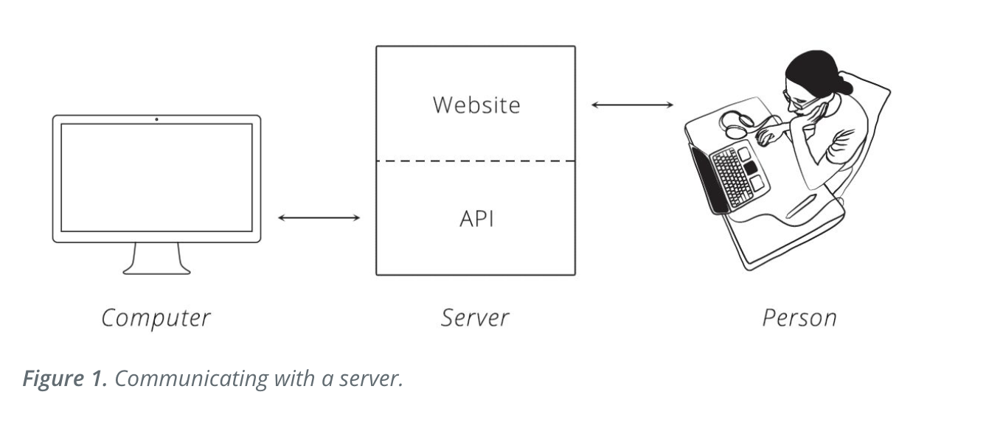
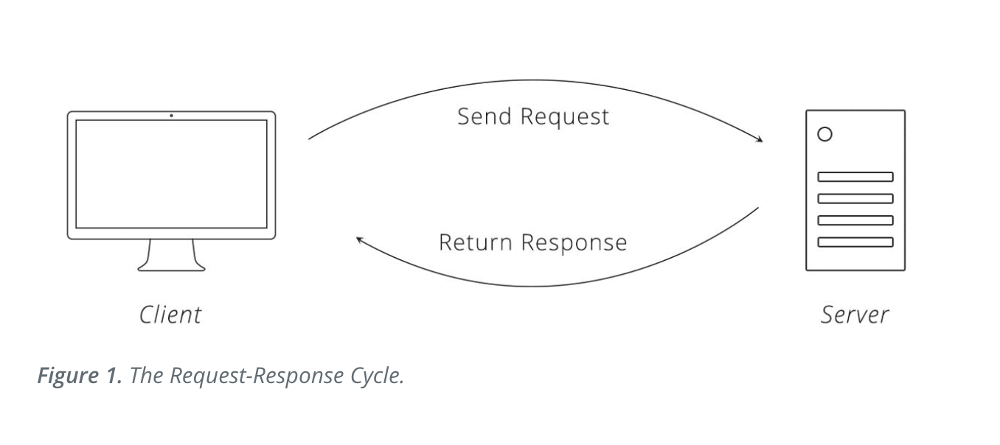

```{r setup, include=FALSE}
knitr::opts_chunk$set(echo = FALSE)
```
## API

API stands for application programming interface

## Summary

OK, Grant. Your turn!

## Servers

* A **server** is a big computer
* It provides *services* for other programs or devices
* some common servers: 
  + database server
  + mail server
  + print server
  + web server 
* Example: A web server will contain one or more web pages and will store, process, and deliver web pages to a **client**

* servers run APIs

## Client

This is a separate program that knows what data is available on a server and through the use of an **API** can manipulate said data. (do you want an example?)

Typically this manipulation is done at the request of a user (like you and me).

## APIs

* An application programming interface (API)

* An API makes a client's request more digestible for a computer and then sends back a response that is digestible for the user.

* The API is part of the server

## Client Server Interaction

 
```{r, out.width='100%', fig.align='center'}

```

(Zapier.com)

these two systems are "integrated" when they are communicating with each other 

## Protocol

**Protocol** is like social etiquette for a computer. 

However, it is much more rigid. Protocol is the set of rules that govern how two computers talk to each other.

An unhelpful but exciting example: social etiquette for Agent Smith's and HAL 9000's first date 

There are many different protocols. For example, Bluetooth and HTTP. 

## HTTP Protocol 

We will look at the Hyper-Text Transfer Protocol (HTTP) in a little more depth.

When you type `http://itsdinnertime.com` you inform the browser, client, to use the HTTP rules to talk to the server

## Requests

**Requests** come from the clients and ask the server to do something (clients are the needy ones in this relationship).

A request might be "get me some data" or "send this email" or "what is South Africa's involvement in the assassination of Iranian leader" 

## HTTP Requests (1/2)

HTTP uses the Request-Response Cycle. 
  
  * Client makes a request
  * Server, via API, processes request and sends back a response
  * The ball is now in the client's court again
  
```{r, out.width='100%', fig.align='center'}
 

```
 
  (Zapier.com)
  
## HTTP Requests (2/2)  

To follow the HTTP rules a request must have the following:

1. URL (an adress for a "noun")
2. **Method** (we will focus on this)
3. List of Headers (meta-infromation)
4. Body ( the data the client wants to send the server)

## Methods

Client side. What kind of action the client wants the server to take. Four common request methods:

* GET: asks server to retrieve resource
* POST: asks server to create a new resource
* PUT: asks server to edit/update an existing resource
* DELETE: asks server to delete a resource DX

## Death Star Example

* POST: Sith Lord asks the boys to make ANOTHER Death Star
* PUT: Sith Lord asks the boys to modify construction and make this Death Star even more destructive
* GET: Sith Lord asks the boys how progress is going (involves a personal visit from the Sith Lord himself *gasp* )
* DELETE: Sith Lord decides to can the project and tricks the Rebellion into blowing it up

## Response 

The **Response** is exactly what it sounds like.
  
  * server recieves request
  * server attempts to fulfill request
  * server sends back response 

Responses contain:

1. Status Code (404 200 etc)
2. Header (meta-info, bay-beee) 
3. Body (actual content that was requested)

## ...

#417 Expectation Failed


