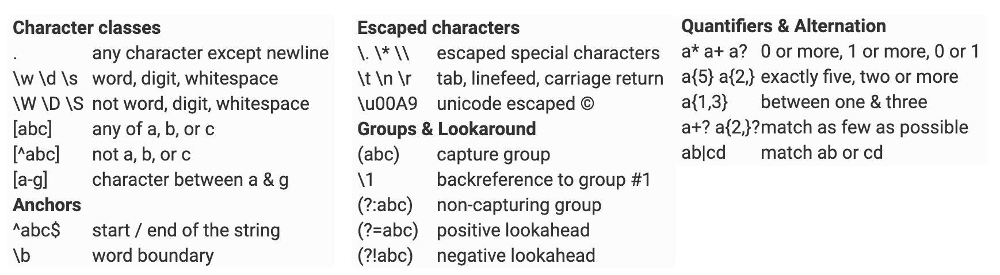
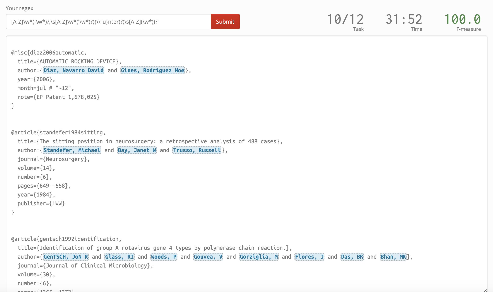

```{r setup, include=FALSE}
knitr::opts_chunk$set(echo = FALSE)
```

# grep: Global Regular Expression, Print

```{r, echo = TRUE}
professors <- c("grant", "glen", "ben")
```
--
```{r, echo = TRUE}
#Look for the pattern "g" and print results
grep(pattern = "g", x = professors, value = TRUE)
```
--
```{r, echo = TRUE}
#Use grep(, value = FALSE) to get indices
grep(pattern = "g", x = professors, value = FALSE)
```
--
```{r, echo = TRUE}
#Use grepl() to return a logical vector
grepl(pattern = "g", x = professors)
```

---

# sub and gsub: pattern replacement

```{r, echo = TRUE}
professors <- c("grannt", "glenn", "benn")
```
--
```{r, echo = TRUE}
#Use sub() to replace the first occurence of a pattern
sub(pattern = "n", replacement = "r", x = professors)
```
--
```{r, echo = TRUE}
#Use gsub() to replace every occurence of a pattern
gsub(pattern = "n", replacement = "r", x = professors)
```

---

# More complicated patterns: regex

```{r, echo = TRUE}
students <- c("Colleen O'Briant", "Benjamin Jacob Schefrin",
              "Garrett", "jholste", "Brad Bailey", "smshihab", 
              "Kevin Song", "Ethan Holdahl", "pramod-dudhe", 
              "Promise Kamanga", "Shan Zhang", "Robert McDonough",
              "chris")
```
--
```{r, echo = TRUE}
#Who set up their github profiles with their first and last names?
grep(pattern = "\\s", x = students, value = TRUE)
```
--


---
# More complicated patterns ctd


```{r, echo = TRUE}
#Who doesn't capitalize their own name?
grep(pattern = "^[a-z]", x = students, value = TRUE)
```
---
# More complicated patterns ctd


```{r, echo = TRUE}
#Who has 15 or more characters in their name?
grep(pattern = ".{15,}", x = students, value = TRUE)
```

---

# [Regular Expressions Online Game!](http://play.inginf.units.it/#/) 


---
#More
[Bigger Cheat Sheet](https://rstudio.com/wp-content/uploads/2016/09/RegExCheatsheet.pdf)

[RegExplain Guide](https://apps.garrickadenbuie.com/regexplain/)
