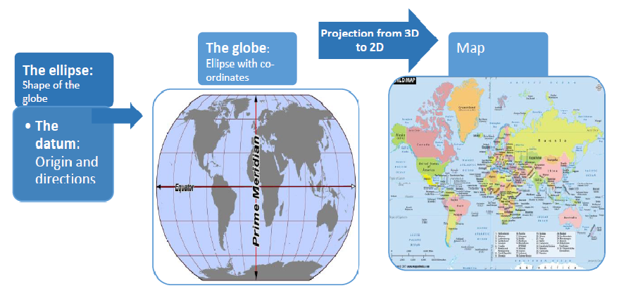

## Introduction
We are in the spatial (geographical) world

Two fundamental types of spatial data:

- The **vector data model** represents the world using points

*Plots points, lines and polygons based on a pre-defined origin.*
*Combine to make well defined boundaries.*

- The **raster data model** divides the surface into pixels. 

*So, scalable, more continious.* 

## Co-ordinate reference systems (CRS): Some packages
These are the baseline packages that you`ll need to get introduced to working with spatial data in R.

```{r libraries}
library(pacman)
# Different libraries that we need
p_load(sf, raster, spData, spDataLarge, rgdal, 
       sp, maps, mapdata, mapproj, ggplot2, ggpubr)

# sf is simple features, needed for common vector geometry types
# raster is for raster type data
# spData and spDataLarge contains datasets for practice
# sp is for selection, and plotting and etc of spatial data
# rgdal is for CRS transformations
```


## CRS : Why not a cartesian grid ?
It is a standardized way of representing locations with a triplet: (Ellipses, Datum, Projections)

- Ellipse : shape of the space you are mapping
- Datum : Origin and direction of axises
- Projection : A type of (not necessarily linear) scaling

Why can we not just work with the datum component ? 

Example:
0CRS defined by : **Ellipse = planar; Datum = lift entrance, right is +x, and front is +y; projection is 1 cm:1 meter**, we can create a map that will work within short distance. 

But if we want to represent larger geographies, a planar ellipse would not work since the earth is elliptical (see [Flat Earth Society](https://theflatearthsociety.org/home/) for arguments otherwise) 

## CRS: basic workings
**Longitude** (Angular distance from Prime Meridian) and **Latitude** (North-South angular distance from equator) can describe a location. But for relative positions in a planar (2D), we need projections.

```{r, fig.align='center', out.width='80%', echo = FALSE}

```

## CRS: Different systems

In R, each CRS is defined by either:

- **epsg code**: A code that refers to a unique, predefined CRS. 

Popular ones include WGS84 (EPSG: 4326 - used by Google, DoD, GPS) 

NAD84 (EPSG:4269 - used by Federal agencies, aids tracking tectonic shifts)

- **proj4string**: Flexible in the sense that you can mold it to your needs

## CRS: Different systems
Every CRS molds a 3D object to 2D, so it creates distortions. Distortion increases with distance from origin of CRS. *(Projection gets worse as we move from distance)*

Common projections include Mercator, Azimuthal Equal Area, Universal Transverse Mercator
```{r, creating maps, echo = FALSE}
states <- map_data("state")
usamap <- ggplot(states, aes(x=long, y=lat, group=group)) +
 geom_polygon(fill="white", colour="black") + ggtitle("Mercator: For navigation")
usamap1 <- ggplot(states, aes(x=long, y=lat, group=group)) +
 geom_polygon(fill="white", colour="black") + ggtitle("Azimuthal Equal Area")
usa1 <-usamap + coord_map("mercator")
usa2 <- usamap1 + coord_map("azequalarea") 
ggarrange(usa1, usa2, ncol = 2, nrow = 1)
```

## CRS in R
```{r commands, echo = TRUE}
print(names(world))# World comes with one of the packge sf
print(world[5,]$geom)
```

## Continued

```{r commands cont, echo=TRUE}
# Different CRSs available
crs_data = rgdal::make_EPSG()
print(head(crs_data))
```

## Continued
```{r commands cont2, include=FALSE}
# How to plot, using Zion NP geo
zion_filepath = system.file("vector/zion.gpkg", package = "spDataLarge")
zion_vector = st_read(zion_filepath)
```

```{r commands cont3, echo=FALSE}
# Units are embedded, Finding area

cat("Area of Zion using st_area(zion_vector) is", st_area(zion_vector), "meter squared." )

cat("We set kilometers using units::set_units(). \n", "In Kilo-meters, it is", units::set_units(st_area(zion_vector), km^2), "kilo-meter squared." )
```
## The End

Thanks for your attention !

Resoruces:

[Overview of CRS](https://www.nceas.ucsb.edu/~frazier/RSpatialGuides/OverviewCoordinateReferenceSystems.pdf)

[Geo-computation withR](https://geocompr.robinlovelace.net/spatial-class.html#crs-intro)