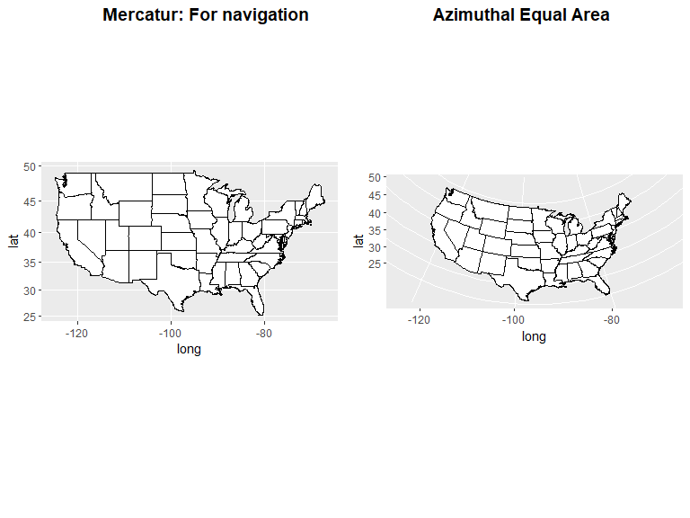
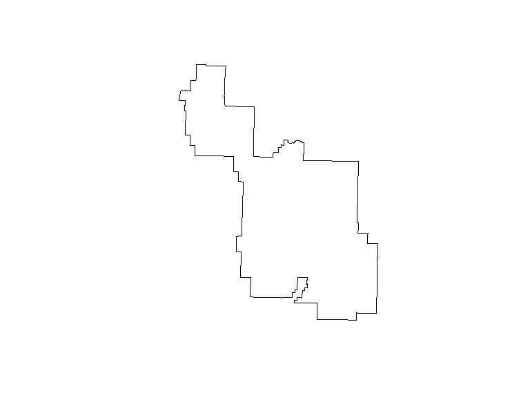

## Introduction

We are in the spatial (geographical) world

Two fundamental types of spatial data:

- The **vector data model** represents the world using points

*Plots points, lines and polygons based on a pre-defined origin.*
*Combine to make well defined boundaries.*

- The **raster data model** divides the surface into pixels. 

*So, scalable, more continious.* 

## Co-ordinate reference systems (CRS): Some packages

These are the baseline packages that you`ll need to get introduced to working with spatial data in R.


```r
library(pacman)
# Different libraries that we need
p_load(sf, raster, spData, spDataLarge, rgdal, 
       sp, maps, mapdata, mapproj, ggplot2, ggpubr)

# sf is simple features, needed for common vector geometry types
# raster is for raster type data
# spData and spDataLarge contains datasets for practice
# sp is for selection, and plotting and etc of spatial data
# rgdal is for CRS transformations
```


## CRS : Why not a cartesian grid ?

It is a standardized way of representing locations with a triplet: (Ellipses, Datum, Projections)

- Ellipse : shape of the space you are mapping
- Datum : Origin and direction of axises
- Projection : A type of (not necessarily linear) scaling

Why can we not just work with the datum component ? 

Example:
0CRS defined by : **Ellipse = planar; Datum = lift entrance, right is +x, and front is +y; projection is 1 cm:1 meter**, we can create a map that will work within short distance. 

But if we want to represent larger geographies, a planar ellipse would not work since the earth is elliptical (see [Flat Earth Society](https://theflatearthsociety.org/home/) for arguments otherwise) 

## CRS: basic workings

**Longitude** (Angular distance from Prime Meridian) and **Latitude** (North-South angular distance from equator) can describe a location. But for relative positions, we need projections.


## CRS: Different systems

In R, each CRS is defined by either:

- **epsg code**: A code that refers to a unique, predefined CRS. 

Popular ones include WGS84 (EPSG: 4326 - used by Google, DoD, GPS) 

NAD84 (EPSG:4269 - used by Federal agencies, aids tracking tectonic shifts)

- **proj4string**: Flexible in the sense that you can mold it to your needs

## CRS: Different systems

Every CRS molds a 3D object to 2D, so it creates distortions. Optimum CRS depends on need

Distortion increases with distance from origin of CRS. *(The way I thought of it is when we did local linear approximation, we saw that linear approximation got worse when it was not local any more. Similar mechanism is at play.)* 

<!-- -->

## CRS in R: Some useful commands / information


```r
# World comes with one of the packge sf
print(names(world))
```

```
##  [1] "iso_a2"    "name_long" "continent" "region_un" "subregion" "type"     
##  [7] "area_km2"  "pop"       "lifeExp"   "gdpPercap" "geom"
```

```r
us <- world[5,]
print(us$geom)
```

```
## Geometry set for 1 feature 
## geometry type:  MULTIPOLYGON
## dimension:      XY
## bbox:           xmin: -171.7911 ymin: 18.91619 xmax: -66.96466 ymax: 71.35776
## epsg (SRID):    4326
## proj4string:    +proj=longlat +datum=WGS84 +no_defs
```

```
## MULTIPOLYGON (((-122.84 49, -120 49, -117.0312 ...
```
## Continued


```r
# Different CRSs available
crs_data = rgdal::make_EPSG()
print(head(crs_data,2))
```

```
##   code     note
## 1 3819 # HD1909
## 2 3821  # TWD67
##                                                                                            prj4
## 1 +proj=longlat +ellps=bessel +towgs84=595.48,121.69,515.35,4.115,-2.9383,0.853,-3.408 +no_defs
## 2                                                         +proj=longlat +ellps=aust_SA +no_defs
```

```r
# How to plot, using Zion NP geo
zion_filepath = system.file("vector/zion.gpkg", package = "spDataLarge")
zion_vector = st_read(zion_filepath)
```

```
## Reading layer `zion' from data source `C:\Users\shiha\OneDrive\Documents\R\win-library\3.6\spDataLarge\vector\zion.gpkg' using driver `GPKG'
## Simple feature collection with 1 feature and 11 fields
## geometry type:  POLYGON
## dimension:      XY
## bbox:           xmin: 302903.1 ymin: 4112244 xmax: 334735.5 ymax: 4153087
## epsg (SRID):    NA
## proj4string:    +proj=utm +zone=12 +ellps=GRS80 +towgs84=0,0,0,0,0,0,0 +units=m +no_defs
```

```r
plot(zion_vector$geom)
```

<!-- -->

```r
print(st_area(zion_vector))
```

```
## 601801921 [m^2]
```
## The End

Thanks for your attention !

Resoruces:
[Overview of CRS](https://www.nceas.ucsb.edu/~frazier/RSpatialGuides/OverviewCoordinateReferenceSystems.pdf)
[Geo-computation with R](https://geocompr.robinlovelace.net/spatial-class.html#crs-intro)
