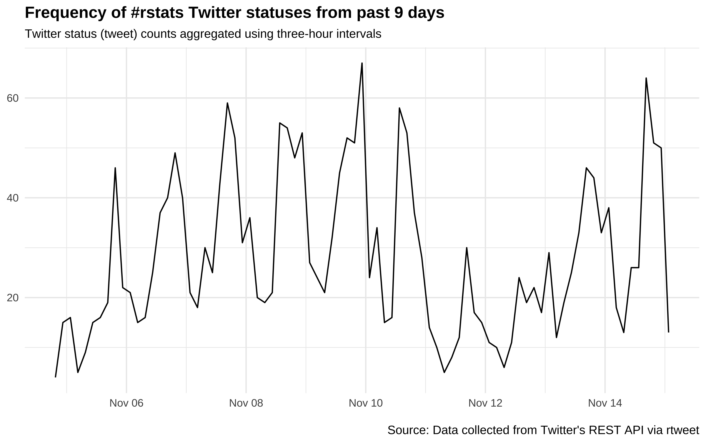
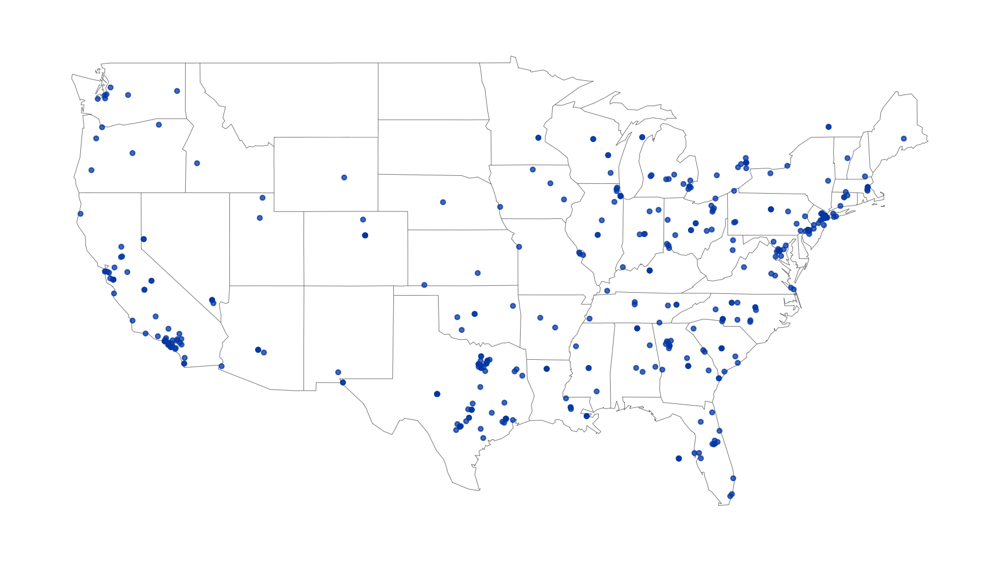

## Twitter Fundamentals

- 'microblogging' website: users can create, share, and respond to posts that are a maximum of 280 characters long
- twtter automatically generates 'trends' based on location, via an algorithm
- some definitions:
1. feed: stream of tweets on your homepage
2. follows: followed users' tweets and re-tweets appear in your feed
3. hashtag: user-created tweet/topic identifier
- rtweet communicates with twitter's REST api so you dont have to!

## Package Features

- Search tweets: search_tweets() - up to 18,000 from the past 6-9 days
- Search Users: search_users()
- Search trends by location: get_trends("location")
- Use and visualize as a time series: ts_plot() and ts_data()
- Get followers/following: get_friends() and get_followers()
- Get recent tweets: get_timeline()
- Get favorites: get_favorites()
- Live stream tweets: stream_tweets() with options:
1. random sampling
2. filtering by content (e.g. by hashtag)
3. by location: lookup_coords() (requires google API key)
4. tracking by user id

- and many more!

## Installation and Usage

Basic funtionality requires a twitter account and the 'httpuv' package: running an rtweet function in a live session of RStudio will prompt a browser popup to authorize the embedded 'rstats2twitter' app.

For full functionality (posting tweets etc.) one must apply for a twitter developer account and create a user app. See https://rtweet.info/articles/auth.html.

## Examples

```{r eval = FALSE}
## search for 18000 tweets using the rstats hashtag
## excludes retweets
rt <- search_tweets(
  "#rstats", n = 18000, include_rts = FALSE
)

## plot time series of tweets
rt %>%
  ts_plot("3 hours") +
  ggplot2::theme_minimal() +
  ggplot2::theme(plot.title = ggplot2::element_text(face = "bold")) +
  ggplot2::labs(
    x = NULL, y = NULL,
    title = "Frequency of #rstats Twitter statuses from past 9 days",
    subtitle = "Twitter status (tweet) counts aggregated using three-hour intervals",
    caption = "\nSource: Data collected from Twitter's REST API via rtweet"
  )
```

---



---

```{r eval = F}
## search for 10,000 tweets sent from the US
rt <- search_tweets(
  "lang:en", geocode = lookup_coords("usa"), n = 10000
)

## create lat/lng variables using all available tweet and profile geo-location data
rt <- lat_lng(rt)

## plot state boundaries
par(mar = c(0, 0, 0, 0))
maps::map("state", lwd = .25)

## plot lat and lng points onto state map
with(rt, points(lng, lat, pch = 20, cex = .75, col = rgb(0, .3, .7, .75)))
```

---



## Citation and repo

Kearney MW (2019). “rtweet: Collecting and analyzing Twitter data.” Journal of Open Source Software, 4(42), 1829. doi: 10.21105/joss.01829, R package version 0.7.0, https://joss.theoj.org/papers/10.21105/joss.01829.

- https://github.com/ropensci/rtweet
