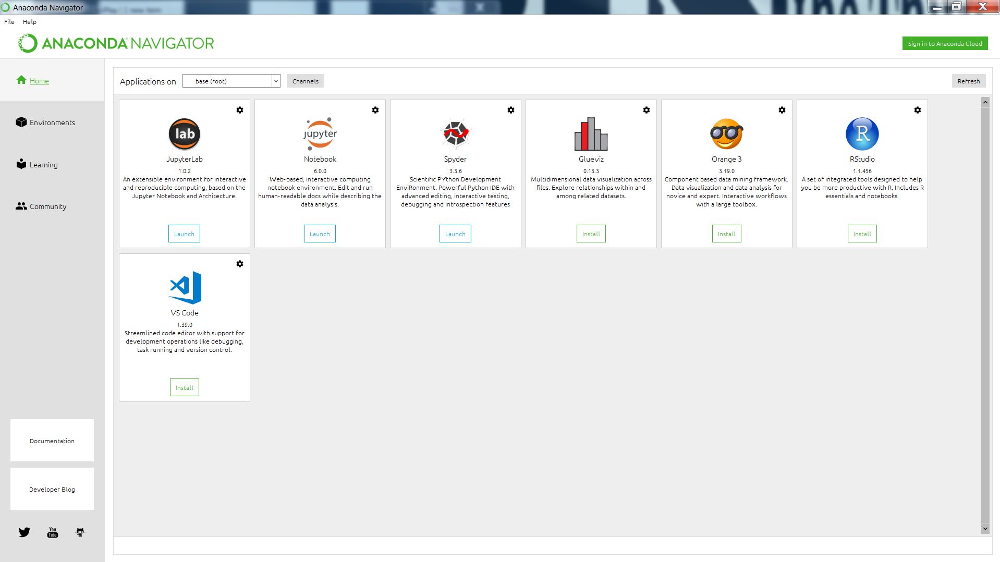

```{r setup, include=FALSE}
options(htmltools.dir.version = FALSE)
library(knitr)
opts_chunk$set(
  fig.align="center",  
  fig.height=4, #fig.width=6,
  # out.width="748px", #out.length="520.75px",
  dpi=300, #fig.path='Figs/',
  cache=T#, echo=F, warning=F, message=F
  )
library(tidyverse)
```

# Table of Contents
1. [Conda](#conda)
2. [Anaconda Navigator](#navigator)
3. [Jupyter Notebook](#jupyter)
  

---
name: conda

## Conda

- Conda is an open source package and environment management system
- Enables you to quickly run, update, and install packages
- Designed for Python but can package and distribute for  a host of other languages

### Requirements

- Requires you to download Anaconda and Python (links in the Resources slide) 
---
## Managing Environments

1.Creating a new environment and install a package in it
Name the environment ***example*** and install BioPython package
```{}
conda create --name example biopython
```
Conda check for package dependencies and will prompt you to proceed
```{}
Proceed ([y]/n)? y
```
2.Activate New Environment
```{}
conda activate example
```
---
3.List Environments
```{}
conda info --envs
```
```{}
conda environments:

    base           /home/username/Anaconda3
    example   * /home/username/Anaconda3/envs/example
```
Note: * indicates the active environment
You can switch to another environment using the activate command again.
---
## Managing Packages
1.Activate an environment (see Manage Environments slide)

2.Check to see if a Package "beautifulsoup" exists in your Anaconda repository (requires internet access)
```{}
conda search beautifulsoup
```
3.Install the Package
```{}
conda install beautifulsoup
```
4.List available packages
```{}
conda list
```
---
5.Update a Package
```{}
conda update beautifulsoup
```
6.Remove a Package from Environment ***example***
```{}
conda remove -n example beautifulsoup
```
---

## Update your packages with conda update

Or update all of them with r-caret

```{}
conda update r-caret
```

## Create a New Environment 

```{}
conda create -n r-environment r-essentials r-base
conda activate r-environment
```
---
name: navigator

# Anaconda Navigator

Anaconda Navigator is a GUI included in Anaconda Distributio (its already downloaded) that enables easy access to applications and management of packages, environments, and channels.

---
One of the key features of Anaconda Navigator is that it is able to organize multiple environments, which can run multiple languages of a variety of versions.
For instance I can create an environment which can hold both Python 3.7 scripts and R scripts. 
```{r, out.width = "700px", out.height= "350px"}

```

---
name: jupyter
# Jupyter Notebook

### What is it?

Jupyter Notebook allows you to create and share live documents that contain code, visualizations, equations, and narrative text. Think like google drive but with the ability to share live coded documents
 

### Downloading

You can use the Conda package in Anaconda Prompt to download
```{}
conda install -c conda-forge notebook
```
---
## Using R in Jupiter Notebook

1.Open Anaconda Navigator (it was installed with Anaconda)
2.Install R language and r-essential packages by selecting ***Environments*** and then ***Create***. Make sure both the ***Python*** and ***R*** boxes are selected and then select ***r*** from the drop down menu.
```{r, out.width = "500px", out.height= "250px"}

```
---

---
3.Now open the newly created environment with Jupyter Notebook.

---
4.Then create a new R notebook by selecting ***R*** in the ***New** drop down menu.

5.This new file can run code similar to an R script but now contained in this new environment

---

## Using Jupyter

Two major terms:

- Kernel: computational engine that executes code in the journal (Such as Python, C++, R, etc.)
- Cell: a container of text or code to be executed

In a sense a notebook file is akin to a script file

---
## Using a Notebook-Check Points

Everytime you save your document a new checkpoint file is created

This checkpoint will be located within a hidden subdirectory: ***.ipynb_checkpoints***

Hence you can restore back to a previously saved version in case of an incident (note: Jupyter Note autosaves every 120 seconds)
---
# Sharing and Exporting

### Preping the Notebook

1. Click "Cell>All Output>Clear" (Clears Output)
2. Click "Kernal>Restart & Run All" (Reruns Notebook)
3. Check that all cells execute

- These steps are not required but are best practice to ensure there exists no intermediate output or have a stale state.

### Exporting to Github using Gists

1. Sign in and browse to gist.github.com.
2. Open your .ipynb file in a text editor, select all and copy the JSON inside.
3. Paste the notebook JSON into the gist.
4. Give your Gist a filename (remember to add .iypnb or this will not work)
5. Click either “Create secret gist” or “Create public gist.”

---
# Other Important Features

### Magics

These are commands built into the IPython kernel to enable particular tasks
- Line Magics(%): applies to a single line
- Cell Magics(%%): applies to a whole cell
- Shell Magics(!): Magics in the Command Shell

### Executing Other Languages

In the IPython Kernel you can execute single cells in other programming languages such as html or Latex
---
### Executing External Code

Jupyter allows you to import and run external scripts for larger projects
- %load: Loads external script
- %run: Runs said script

### Other Goodies

- Connect to databases
- Style your notebook
- Macros
- Logging Configuration
---
# Resources

- Download Python:https://www.python.org/downloads/
- Download Anaconda:https://www.anaconda.com/distribution/
- Conda User Guide: https://conda.io/projects/conda/en/latest/user-guide/index.html 
- Anaconda Navigator Tutorial: https://docs.anaconda.com/anaconda/navigator/
- Jupyter Notebook Tutorial:https://www.dataquest.io/blog/jupyter-notebook-tutorial/
- Jupyter Notebook Advanced: https://www.dataquest.io/blog/advanced-jupyter-notebooks-tutorial/
- R in Jupyter Notebook:https://docs.anaconda.com/anaconda/navigator/tutorials/r-lang/
- IPython Magics: https://ipython.readthedocs.io/en/stable/interactive/magics.html
- Anaconda, Boa, and Python Comparison:https://sciencing.com/differences-between-boa-python-anaconda-8351539.html
