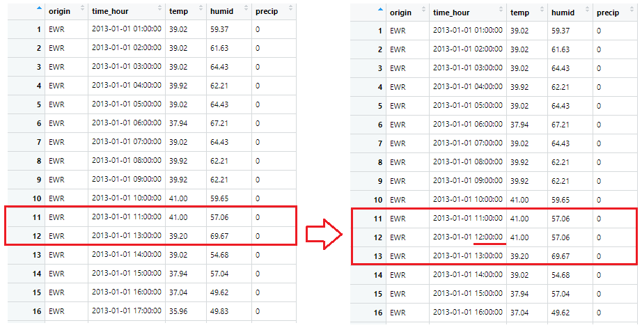

```{r setup, include=FALSE}
options(htmltools.dir.version = FALSE)
options(servr.daemon = TRUE)
knitr::opts_chunk$set(echo = TRUE, cache = TRUE, error = TRUE, dpi=300)
```

```{r xaringan-themer, include=FALSE}
library(xaringanthemer)
mono_accent(base_color = "#43418A")
```


class: inverse, middle, left

# 1) tsibble

# 2) fable

---


```{r libs, message=FALSE, warning=FALSE, cache=F, include=FALSE}
library(pacman)
p_load(knit, tsibble, fable, dplyr, nycflights13)

```

## 1) tsibble

```{r t1, eval=FALSE}
install.packages("tsibble")
```

> The **`tsibble`** package extends the tidyverse to temporal data. 

- Built on top of the tibble, **`tsibble`** is a data- and model-oriented object.

- Comparison to R-based time series objects (`ts`, `zoo` and `xts`)

  - **`tsibble`** preserves time indices as the essential data column and makes heterogeneous data structures possible. 
  
  - Beyond the tibble-like representation, **key** is introduced to uniquely identify observational units over time (index). 
  
  - The tsibble package aims at managing temporal data and getting analysis done in a fluent workflow.

---

## Basic Structure

> To coerce data frame to tsibble, we need to declare **key** and **index**. 

<p>&nbsp;</p>

- **`tsibble()`** creates a _tsibble object_ and **`as_tsibble()`** is an S3 method to coerce other objects to a tsibble. 

- Vector/Matrix objects can be automated to a tsibble using **`as_tsibble()`** without any specification. 

- For a tibble or data frame, **`as_tsibble()`** requires to declare the **key** and **index** variables.

---

## Basic Structure

> To coerce data frame to tsibble, we need to declare **key** and **index**. 

<p>&nbsp;</p>

- In tsibble:

1. **Key** is a set of variables that define subjects measured over time.

  - **identifier**

2. **Index** is a variable with inherent ordering from past to present 

  - **time-relevant variable**
   
3. Each observation should be uniquely identified by **key** and **index**.

4. Other non-identified variables are referred to as _measured_ variables.

---

## Contextual semantics: **key** and **index**

- **Key** can be comprised of empty, one, or more variables. 
  - For multiple variables, declare `key = c(x1, x2, x3)`. 
  - can be created in conjunction with tidy selectors like `starts_with()`

- **Index** supports an extensive range of indices 
    - native time classes in R (Date, POSIXct, difftime, etc.)
    - tsibble's new additions (yearweek, yearmonth, and yearquarter)

- **Interval** is computed from index based on corresponding time class.

|Class                    |interval                    |
|-------------------------|----------------------------|
|interger/numeric/ordered | either "unit" or "year"(Y)|
|yearquarter/yearqtr      | "quarter"(Q)|
|yearmonth/yearmon        | "month"(M)|
|yearweek                 | "week"(W)|
|Date / difftime          | "day"(D) / W, D, h, m, s|
|POSIXt, hms / nanotime   | h, m, s, us, ms / ns|
---

## Ex) nycflights13::weather

- The `weather` data contains the hourly records (temperature, humid and precipitation) over the year of 2013 at three stations (JFK, LGA and EWR).

```{r t2_1, echo=TRUE, highlight.output=c(1)}
weather <- nycflights13::weather %>% 
  select(origin, time_hour, temp, humid, precip)

weather
```

---

## Ex) nycflights13::weather

- `time_hour` containing the date-times should be declared as **index**

- `origin` should be declared as **key**. 

- Other columns can be considered as measured variables. 

```{r t2_2, echo=TRUE, highlight.output=c(1,2)}
weather_tsbl <- as_tsibble(weather, 
                           key = origin, #<<
                           index = time_hour) #<<
weather_tsbl
```
---

# fill_gaps()

> **fill_gaps()** turns implicit missing values into explicit.

- If the observations are made at regular time interval, we could turn these implicit missingness to be explicit simply using `fill_gaps()`.

- `fill_gaps()` also handles filling in **time gaps** by values or functions and respects time zones for date-times.

```{r t3, echo=TRUE, highlight.output=c(1,3)}
full_weather <- weather_tsbl %>%
  fill_gaps(precip = 0) %>% #<<  
#filling gaps in precip with 0
  group_by_key() %>% 
  tidyr::fill(temp, humid, .direction = "down") 
#replaces NAs with its previous observation for each origin (key)

full_weather
```

---

# fill_gaps()



---

# index_by() + summarise()

> **`index_by()`** + **`summarise()`** to aggregate over calendar periods

<p>&nbsp;</p>

- tidy data representation mostly supports part of a “data pipeline” in time-based context. 

- `index_by()` is the counterpart of `group_by()` in temporal context, but it groups the time index only. 

- In conjunction with `index_by()`, **`summarise()`** and its scoped variants aggregate variables over calendar periods.

- `index_by()` goes hand in hand with the index functions including `as.Date()`, `yearweek()`, `yearmonth()` and `yearquarter()`, as well as other friends from `lubridate`. 

---

# index_by() + summarise()

**Example**) To compute _average_ temperature and _total_ precipitation *per month*, we can apply `yearmonth()` to the index variable (referred to as .).

  - While collapsing rows (by `summarise()`), `group_by()` and `index_by()` take care of updating the key and index respectively.

```{r t4, echo=TRUE, highlight.output=c(3, 4)}
full_weather %>%
  group_by_key() %>%
  index_by(year_month = ~ yearmonth(.)) %>% #<<
  # monthly aggregates with new variable name (year_month)
  summarise(
    avg_temp = mean(temp, na.rm = TRUE),
    ttl_precip = sum(precip, na.rm = TRUE)
  )
```

---

# Rolling with slide(), tile(), stretch()

- Several functions in tsibble allow for different variations of moving windows using purrr-like syntax:

  - `slide()`: sliding window with overlapping observations.
  - `tile()`: tiling window without overlapping observations.
  - `stretch()`: fixing an initial window and expanding to include more observations. 
  
<p align="center">

</p>

---

## 2) fable

```{r f1, eval=FALSE}
install.packages("fable")
```

> **fable** package provides a collection of commonly used univariate and multivariate time series forecasting models 

<p>&nbsp;</p>

- Forecasing models include exponential smoothing via state space models and automatic ARIMA modelling.

- These models work within the fable framework, which provides the tools to evaluate, visualise, and combine models in a workflow consistent with the tidyverse.

---

# Example

```{r f2, eval=FALSE}
p_load(fable, tsibble, tsibbledata, lubridate, dplyr, feast)

aus_retail %>%
  filter(
    State %in% c("New South Wales", "Victoria"),
    Industry == "Department stores"
  ) %>% 
  model(
    ets = ETS(box_cox(Turnover, 0.3)),
    arima = ARIMA(log(Turnover)),
    snaive = SNAIVE(Turnover)
  ) %>%
  forecast(h = "2 years") %>% 
  autoplot(filter(aus_retail, year(Month) > 2010), level = NULL)
```

> Sorry, I DO NOT know what `ets` and `snaive` are. 

- Visit [Forecasting: Principles and Practice](https://otexts.com/fpp3) 
  - looks super helpful when dealing with timeseries data


---

# Example

<p align="center">

</p>
