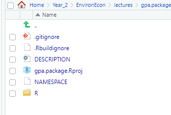
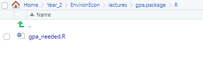
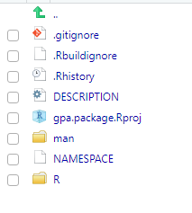
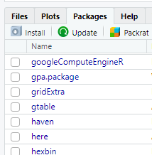

```{r setup, include=FALSE}
library(pacman)
p_load(knitr,tidyverse, data.table, dtplyr, dplyr, hrbrthemes,xaringan, gpa.package, devtools, roxygen2)

opts_chunk$set(
  fig.align="center",  
  fig.height=10, 
  #fig.width=1,
  #out.length="320.75px",
  
  #dpi=300, #fig.path='Figs/',
  cache=FALSE,
  echo = FALSE
)

```

# Why would you write your own package?
## 1. Efficiency 

- Save a useful function on a package instead of copying it into every new script you write.

</br>

- Document how your 300 line function works once, then never need to look at it again<sup>1</sup>

.footnote[
<sup>1</sup> Until it breaks
]
---
# 2. Fame and Glory

```{r   fig.height=8}

```
---
# Leveling Up to Developer

Some cool packages allow us to automate the more cumbersome portions of developing our own package:

- `devtools`

- `roxygen2`

- `usethis`

---
# The Process
</br>

Creating a package is actually pretty simple
</br>
--
1. Create a package directory
</br>
--
2. Add our functions
</br>
--
3. Add documentation
</br>
--
4. Install the package locally
</br>
--
5. Share with the world (optional)


The rest of this presentation will go through these steps in detail, along with an example.

---
# Example
I want to explore how cumulative GPAs develop term-by-term in college. 

To that end, I've written this function:
```{r eval=F, echo=T}
gpa_needed=function(current_gpa,gpa_wanted,terms, plusminus=T){
  gpa_needed_primitive=gpa_wanted*terms-(current_gpa*(terms-1))
  if (plusminus==T){
    answer=ifelse(gpa_needed_primitive>4.3, "Not possible this term", gpa_needed_primitive)
  } else{
    answer=ifelse(gpa_needed_primitive>4, "Not possible this term", gpa_needed_primitive)
  }
  return(answer)
}
```
--
This function says how well a student has to do this term to at least reach some cumulative GPA goal. It takes arguments:
- Current GPA
- The student's GPA goal
- Terms the student has been in school (inclusive of current term)
- Whether the grade scale includes plus/minus grades
---
# Example
I think that I may end up using this function a bunch, across multiple R scripts. 

</br> 
--
So, I'm going to put it in a package.
---
#1. Making a Package Directory
A package directory is essentially just a new R project with a bit of extra structure. 

This is the place where we are going to put all of the functions and documentation we want to include in our package.

- We can copy and edit the functions in our package from inside this directory.

- Once we're finished, we can tell R to turn our directory into a functional package with a few commands in the console. 

</br>
We can use the`create` function from the `devtools` package to create this space.
```{r, eval=F, echo=T}
setwd("Insert_Directory_Here")
create("package_name_here")
```
---
#1. Making a Package Directory-Example

```{r, eval=F, echo=T}
setwd("gpa_project")
create("gpa.package")
```

If you're creating this package directory within an existing project, you'll probably get the following warning message:

>New project 'gpa.package' is nested inside an existing project './', which is rarely a good idea.
>Do you want to create anyway?
>
>1: No
>
>2: I agree
>
>3: Absolutely not

In what I've encountered so far, it's okay to say yes through these warnings. 
- But if you plan to work on/edit this package a bunch, you should probably save it outside of any existing projects.
---
# Package Directory
You should see a new folder created inside of whatever your current  working directory is. 
- This is the package directory

</br>

Inside, we see the normal project files, plus a few extras:

```{r   fig.height=8}

```
---
#2. Add Functions

From here, we add any functions that we want to include in our package to the "R" folder as r scripts.
- Each function can be added as an individual script, or one script can contain multiple functions.
--
```{r   fig.height=8}

```
---
#2. Add Functions-Example
I've saved my gpa function in a script called `gpa_needed.R`

</br>

Now I'm just going to copy that script into my new package directory, under the R subfolder.

```{r   fig.height=8}

```

---
#2. Add Functions-Example
Alternatively, the `usethis` package allows us to create a new, blank R script from the console
- We just have to make sure we've first set the working directory to the location in which we want the new script to be saved
```{r   echo=T, eval=F}
usethis::use_r('gpa_needed')
```

---
#3. Add Documentation
We probably know how our functions works, but if we plan to use this package long-term or share it, we should add some documentation

All of the packages we can download from CRAN will have documentation on each function including:
- A description of what the function does
- Details on how it works
- A desription of each argument
- Examples

</br>
--
</br>
The `roxygen2` package makes adding this stuff quick and painless
</br>
- Though, it is worth noting that we don't need to directly interact with roxygen, devtools does that for us
---
#3.1 Add Documentation

To add documentation to a function in a package, we just add comments to the start of the R script for our function.

</br>
--
We flag the comments as documentation by beginning each line with #' (single quote) 
</br>
--
1. The first line becomes the documentation title
</br>
--
2. Next we put a description of the function
</br>
--
3. We write the different pieces of our documentation  using tags.

</br>
--
The tags allow `devtools` to tell which piece is which. Most are fairly self explanatory, but you can look up the details in the `roxygen` documentation.

- `@param`
- `@examples`

</br>
--
We do need to make sure to add the `@export` tag. This tells roxygen/devtools that we want to add this documentation to the namespace file. 
---
#3.1 Add Documentation- Example 
Below I've added the bare minimum documentation to my gpa function

```{r   echo=T, eval=F}
#'GPA Needed Function
#'
#'This function determines the minimum term GPA a student needs to get in order to ensure that their cumulative GPA meets
#'some goal at the end of the term. If the cumulative GPA goal is unreachable in one term, the function returns a message
#'to that effect
#'@param current_gpa The student's current cumulative GPA
#'@param gpa_wanted The cumulative GPA goal for the end of the term
#'@param terms The number of terms the student has been in college. This includes the current term
#'@param plusminus Whether or not the grading scale is the normal plus/minus scale
#'@export
gpa_needed=function(current_gpa,gpa_wanted,terms, plusminus=T){
  gpa_needed_primitive=gpa_wanted*terms-(current_gpa*(terms-1))
  if (plusminus==T){
    answer=ifelse(gpa_needed_primitive>4.3, "Not possible this term", gpa_needed_primitive)
  } else{
    answer=ifelse(gpa_needed_primitive>4, "Not possible this term", gpa_needed_primitive)
  }
  return(answer)
}
```
---
# 3.15 Relax and pat yourself on the back

We're finished with hard work for the day. `devtools` and `roxygen` will take care of the rest. 

```{r   fig.height=8}

```

---
#3.2 Process the documentation
First, we have devtools process our comments into proper documentation

- The kind of documentation you see when you use the console to look up a function

The process:
</br>
--
1. Make sure the working directory is set to the package folder
</br>
--
2. Run the command `document()` in the console. 
---
#3.2 Process the documentation-Example
Going through this step with our gpa function...
--
```{r echo=T, eval=F }
setwd(gpa.package)
document()
```
After this runs, we'll see some new stuff in our package
```{r fig.height=7}

```
---
#4. Install that Package
Now, we have all the elements we need in our package. We just need to tell R to install it locally. 

</br>
--
Again, we use `devtools`: 

</br>
--
1. Reset the working directory to whichever parent directory holds the package you've made
</br>
--
2. Run the command `install('package_name_here')` in the console. 

</br>

--
To check if the process was successful, you can now search for one of the package functions in the console, as you could with any regular package, or check the package tab in RStudio.
---
#4. Install that Package-Example
Let's finally install our GPA package:

</br>
--

```{r echo=T, eval=F }
setwd(..)
install('gpa.package')
```
---
#4. Install that Package-Example
##Success!


```{r fig.height=7}

```
---
#5. Share with the World

From here, you can do a bit more work to get your package ready to share publicly. 
</br>
--
Github is the most common sharing method, but CRAN is also an option with more work 

</br>
--
I'll leave off here, but the links below detail exactly how to take a package from your computer to the world. 
---
#Links

- https://hilaryparker.com/2014/04/29/writing-an-r-package-from-scratch/
 + From the excellent blog of Hilary Parker. This presentation is largely based on her blog post linked above. 
 
- https://r-mageddon.netlify.com/post/writing-an-r-package-from-scratch/
  + How to add `use_this` to your package creation process
  
- https://www.hvitfeldt.me/blog/usethis-workflow-for-package-development/
  + A deep dive on package creation