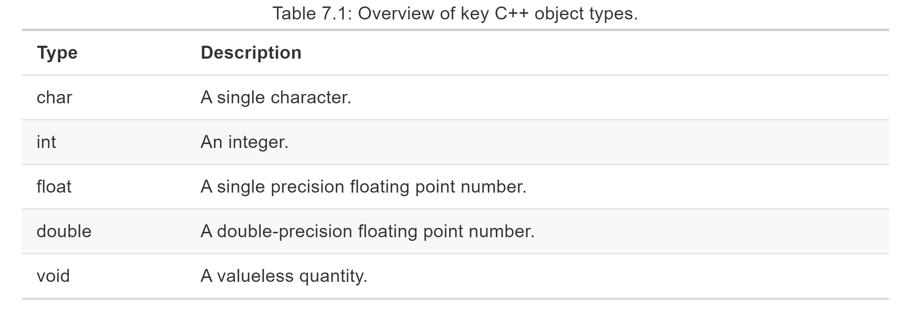

```{r setup, include=FALSE}
options(htmltools.dir.version = FALSE)
library(pacman)
p_load(knitr,tidyverse, data.table, dtplyr, dplyr, hrbrthemes,xaringan)
opts_chunk$set(
  fig.align="center",  
  fig.height=4, #fig.width=6,
  # out.width="748px", #out.length="520.75px",
  dpi=300, #fig.path='Figs/',
  cache=T#, echo=F, warning=F, message=F
  )
```

# Table of Contents

---

# RCPP

*** What is RCPP? ***
Its for all those times where your code is too slow.
Slow enough to learn a whole new programming language.
Rcpp enables you to write C++ code in R!
```{r, out.width = "500px", out.height= "250px"}
knitr::include_graphics("rcpp_performance'.png")
```

---

# Getting Started

Install the RCPP package
```{}
if (!require("pacman")) install.packages("pacman")
p_load(pacman)
```
In addition you will need to install a C++ compiler: \\
*For the enlightened folk on Windows systems: install [Rtools](https://cran.r-project.org/bin/windows/Rtools/) \\
*On Linux: 
```{}
sudo apt-get install r-base-dev
```
*If you are down on your luck and own a Mac: install Xcode from the app store

---

# Differences from R

In the C++ function each line must be terminated with a ";". \\

You must declare object types when using commands in C++. \\

The function MUST have an explicit return statement. Similar to R, there can be multiple returns, but the function will terminate when it hits it’s first return statement. \\

You do not use assignment when creating a function. \\

Object assignment must use = sign. (The <- operator isn’t valid.) \\

One line comments can be created using //. Block comments are created using /*...*/ instead of "#"

---

```{r, out.width = "500px", out.height= "250px"}

```
---

# The cppFunction() Command

cppFunction() enables you to write C++ code in R, just wrap the C++ code in '' \\
Example:
```{}
cppFunction('int add(int x, int y, int z) {
  int sum = x + y + z;
  return sum;
}')
# add works like a regular R function
add
#> function (x, y, z) 
#> .Call(<pointer: 0x7f08dc8450d0>, x, y, z)
add(1, 2, 3)
#> [1] 6
```
---

# Using R in C++ with sourceCpp

In C++ we can embed R Code by starting the C++ file with
```{}
#include <Rcpp.h>
using namespace Rcpp;
/*** R
# Insert R Code Here
*/
```
Example
```{}
#include <Rcpp.h>
using namespace Rcpp;

// [[Rcpp::export]]
double meanC(NumericVector x) {
  int n = x.size();
  double total = 0;

  for(int i = 0; i < n; ++i) {
    total += x[i];
  }
  return total / n;
}

/*** R
x <- runif(1e5)
bench::mark(
  mean(x),
  meanC(x)
)
*/
```

---

# Lists and Dataframes

Rcpp have both list and df classes, however you must specify the class beforehand. \\
Example: Extracting Mean Percentage Error from lm()
```{}
#include <Rcpp.h>
using namespace Rcpp;

// [[Rcpp::export]]
double mpe(List mod) {
  if (!mod.inherits("lm")) stop("Input must be a linear model");

  NumericVector resid = as<NumericVector>(mod["residuals"]);
  NumericVector fitted = as<NumericVector>(mod["fitted.values"]);

  int n = resid.size();
  double err = 0;
  for(int i = 0; i < n; ++i) {
    err += resid[i] / (fitted[i] + resid[i]);
  }
  return err / n;
}

mod <- lm(mpg ~ wt, data = mtcars)
mpe(mod)
#> [1] -0.0154
```

---

# Functions 

Specify with the object type function. Then you can use the catchall term Robject.
```{}
#include <Rcpp.h>
using namespace Rcpp;

// [[Rcpp::export]]
RObject callWithOne(Function f) {
  return f(1);
}

callWithOne(function(x) x + 1)
#> [1] 2
callWithOne(paste)
#> [1] "1"
```
---

# References

[RCPP Package](http://dirk.eddelbuettel.com/code/rcpp.html) \\
[RCPP Basics](https://adv-r.hadley.nz/rcpp.html) \\
[More RCPP](https://csgillespie.github.io/efficientR/performance.html#rcpp) \\
[C++ Tutorial](https://www.w3schools.com/cpp/cpp_for_loop.asp) \\

