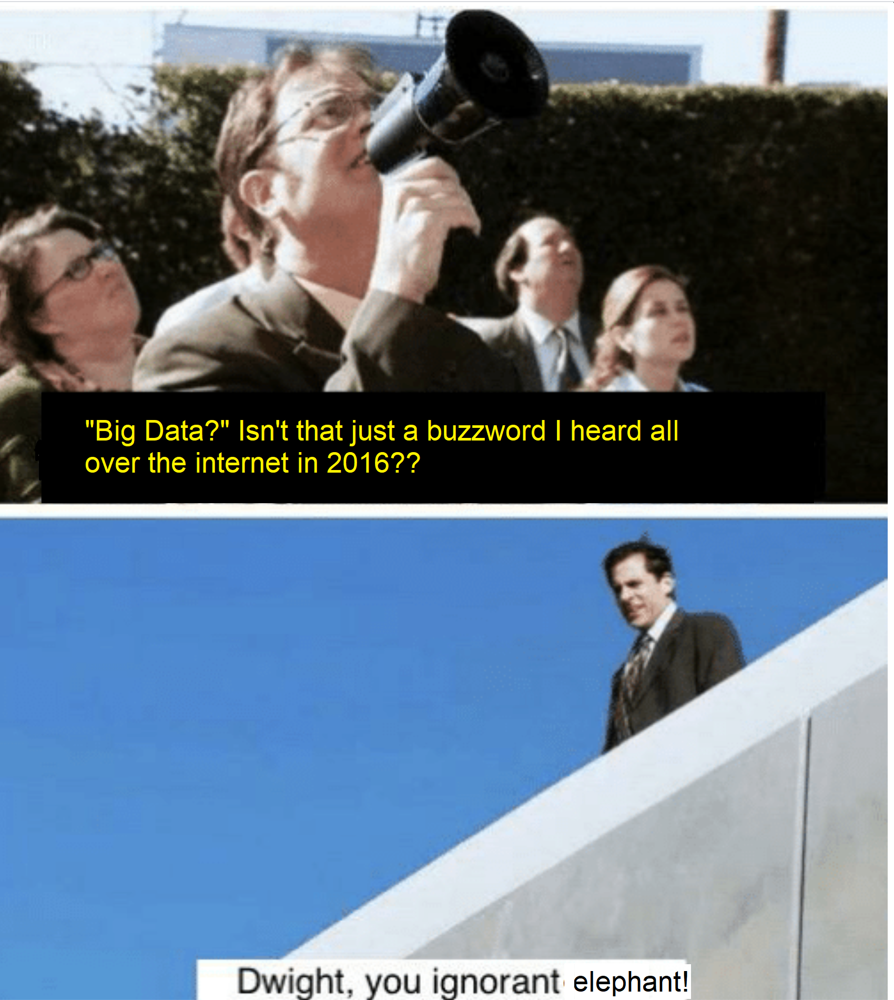
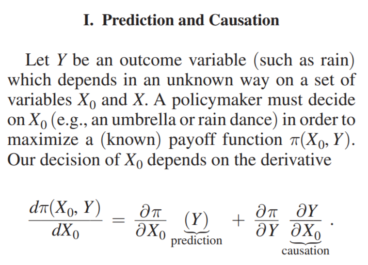
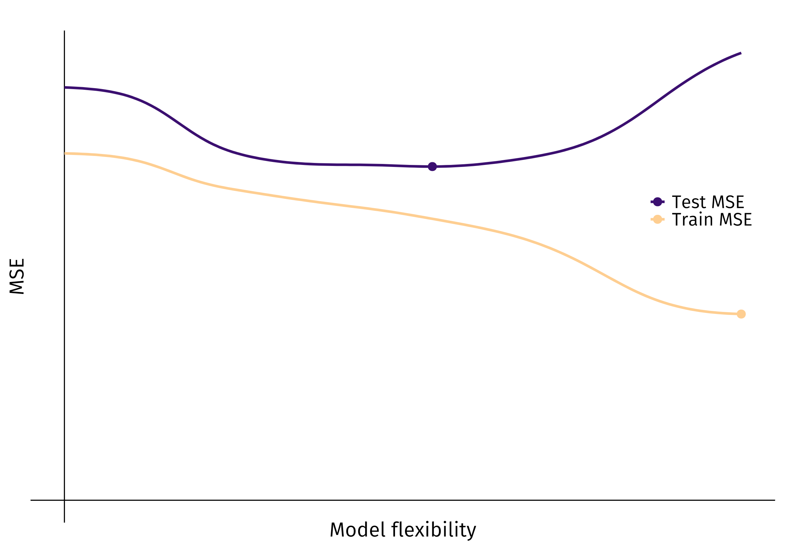
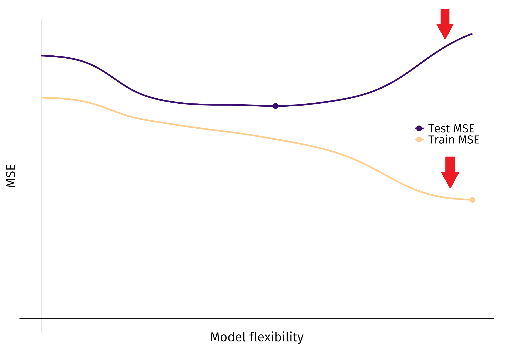

```{r setup, include=FALSE}
options(htmltools.dir.version = FALSE)
```

# "Big Data"

```{r ignorance, echo = F , out.height= "60%" , out.width= "60%" , fig.align='center'}

```


---

# Big Data: How big is "Big"?

Try guessing: How big is Google's web crawler database?

  - 250 Terabytes (TB) (=250,000 GB; your laptop probably has 500GB of hard drive space)
  - 5000 TB ( 1TB = 1000GB )
  - 100 Petabytes (PB) (1PB = 100,000,000GB)
  - 12 Exabytes (EB) (1EB = 1,000,000TB)
  
---
# Big Data: How big is "Big"?

Try guessing: How big is Google's web crawler database?

  - 250 Terabytes (TB) (=250,000 GB; your laptop probably has 500GB of hard drive space)
  - 5000 TB ( 1TB = 1000GB )
  - 100 Petabytes (PB) (1PB = 100,000,000GB)
  - **12 Exabytes (EB) (1EB = 1,000,000TB)**
  
---
# What do you do with data that big?

- Your computer can't hold more than 15-30GB of RAM usually, so good luck running a regression on data that big.

--

- If you are doing econometric and causal analysis, like us, you can work with [Google Cloud](http://cloud.google.com) or [Talapas](http://hpcf.uoregon.edu). 


- If you have data that's **really big** like Google data, you (or your boss) probably wants you to use it to predict stuff.

  - Mortage defaults, bankruptcies, probability of a claim being filed, recessions ('sup Jeremy), success of programs, and more.
  
--

- Your data gives you good opportunities to do this!

---
# Machine Learning

- If you wanted to, say...

--

- Predict the effects of open waste burning for a community?
  - Might train a model using remote sensor data from across the globe.

--

- Predict how groundwater remediation will affect neighborhood development outcomes?
  - May take lots of data from remediation projects across the country and fit models.
  

---
# Causality and Prediction

```{r predict-and-cause, echo = F , out.height= "50%" , out.width= "50%" ,  fig.align='center'}

```

- $\frac{\partial Y}{\partial X_0}$ is what we get when we use methods from Ben's class.

--

- Thinking about the "prediction" term: If $Y$ is "rain" and $X_0$ is some policy, our payoff $\pi( \cdot )$ is "dryness." We would need to know how wet it will be in order to know our marginal payoff ( $\frac{\partial \pi}{\partial X_0}(Y)$ ).

---
# Causality and Prediction

- $X_0$ might just be "use an umbrella" in which case $\frac{\partial Y}{\partial X_0} = 0$ (umbrellas keep us dry but don't stop it from raining) but $\frac{\partial \pi}{\partial X_0}(Y) > 0$. Pure prediction problem now.

- $X_0$ might be "sacrifice a pig to Zeus" which has a pure causal impact on rain but otherwise no impact on being dry ( $\frac{\partial \pi}{\partial X_0}(Y) = 0$ and $\frac{\partial Y}{\partial X_0} < 0$ ). Pure causal inference problem.


---
# Causality and Prediction

- "Standard empirical techniques are not optimized for prediction problems..."

- When using OLS with an eye towards inference, we might "throw-out" one variable in (suppose) a 2-variable problem if $\frac{\hat{\beta_2}}{\widehat{s.e.}}$ is small. 

--

  - Bad idea! Including $x_2$ in this case might help our step-ahead *prediction* of $\hat{y}$ even if our estimate of it is biased. .footnote[(Think back to George's class, or ask Kevin, to be reminded that more variables lead to better model fit)]
  
---
# The "bias-variance tradeoff" 

Throwback to Van's class! Let $f$ be the prediction function for $y$...

\begin{align*}
E[(y - \hat{f})^2] = E[( (f + \varepsilon) - \hat{f})^2] &= E[( (f + \varepsilon) - \hat{f} + E[\hat{f}] - E[\hat{f}])^2] \\
&= E[( (f - E[\hat{f}]) + (E[\hat{f}]  - \hat{f}) + \varepsilon )^2]
\end{align*}

--

Bearing in mind that $\varepsilon \sim iid$ this all reduces to:

$$E[(y - \hat{f})^2] = \text{Bias}[\hat{f}]^2 + \text{Var}[\hat{f}] + \sigma^2$$


- Our squared prediction error can be broken down as a function of bias (squared) and variance.

--

- A given model $\hat{f}$ will have lower bias if it includes more terms/is more "flexible", in other words... But it "generally" comes at the cost of having a higher model variance; $\text{Var}[\hat{f}]$ .


---
# Machine learning

Machine learning (ML) techniques are predicated on this trade-off. We can actually recover OLS from this trade-off, too!

--

- "OLS is a special case where we put an infinite (relative) price on bias..." (Kleinberg et. al. 2015)

--

- Machine learning is for when we want to make very effective out-of-sample predictions, and prioritizing sample unbiasedness above all else *isn't* the way to do this.

--

- Machine learning says: In fact, the parameter which weighs variance into our model selection process ( $\lambda$ ; the "tuning parameter" that Jeremy taught us about if you remember that from last term) can be selected optimally!

--

  - Jake is going to teach us about **cross-validation** which is a way we can pick the "best" tuning parameter for our data
  
---
# Risk in machine learning: Overfitting

- We now know that machine learning can help us make good predictions over our big data, by incorporating a penalty for a higher-variance model-- and Jake will get into a lot of good detail in his cross-validation presentation.

--

- I want to highlight one of the famous pitfalls or potential abuses of machine-learning: **Overfitting.**

--


```{r overfitting_1 , out.height= "60%" , out.width= "60%" , fig.align='center', echo = F}

```

---
# Risk in machine learning: Overfitting

- We now know that machine learning can help us make good predictions over our big data, by incorporating a penalty for a higher-variance model-- and Jake will get into a lot of good detail in his cross-validation presentation.

- I want to highlight one of the famous pitfalls or potential abuses of machine-learning: **Overfitting.**

```{r overfitting_2 , out.height= "60%" , out.width= "60%" , fig.align='center', echo = F}

```

---
# Overfitting

```{r overfitting_3 , out.height= "60%" , out.width= "60%" , fig.align='center', echo = F}

```

- The red arrows show where, making the model more "flexible" (i.e. a 3rd-order polynomial fit is "more flexible" than a linear fit) starts to make it perform really well in our training sample (lower MSE, bottom line) but perform really bad in the testing sample (higher MSE, upper blue line).

--

  - By the way, this figure is from [Ed's fantastic lecture notes.](https://raw.githack.com/edrubin/EC524W20/master/lecture/002/002-slides.html)
  
---
# Lessons to conclude

- Big data offers us an opportunity to make great predictions, which could help us pick effective policies as a complement to causal inference.

--

- OLS we've been using all year is like a special case where we downweight the "variance" part of the "bias-variance tradeoff" to zero (upweights unbiasedness "infinitely")

--

- There are many machine learning methods that account for variance in the trade-off that can help us use our big data to make better predictions.

--

- Overfitting is bad. Really try to not do it.