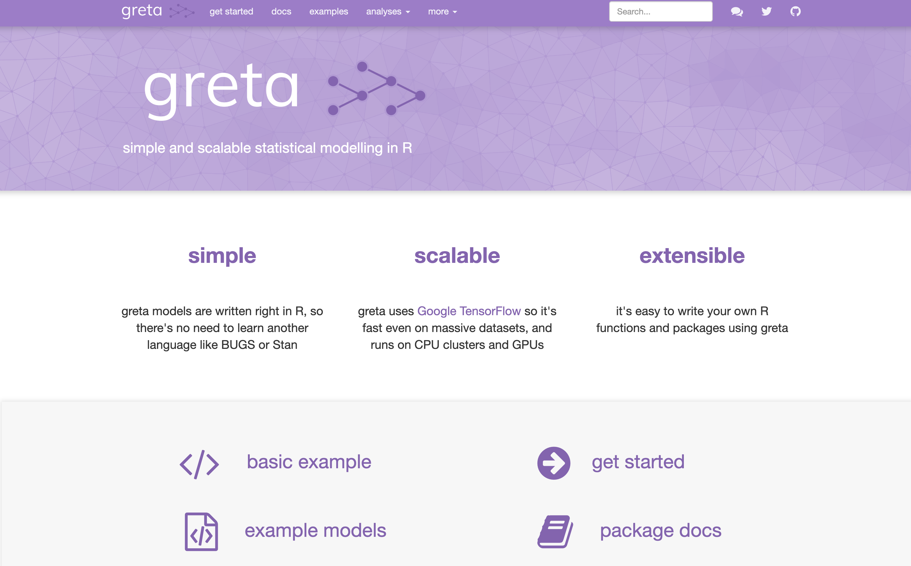
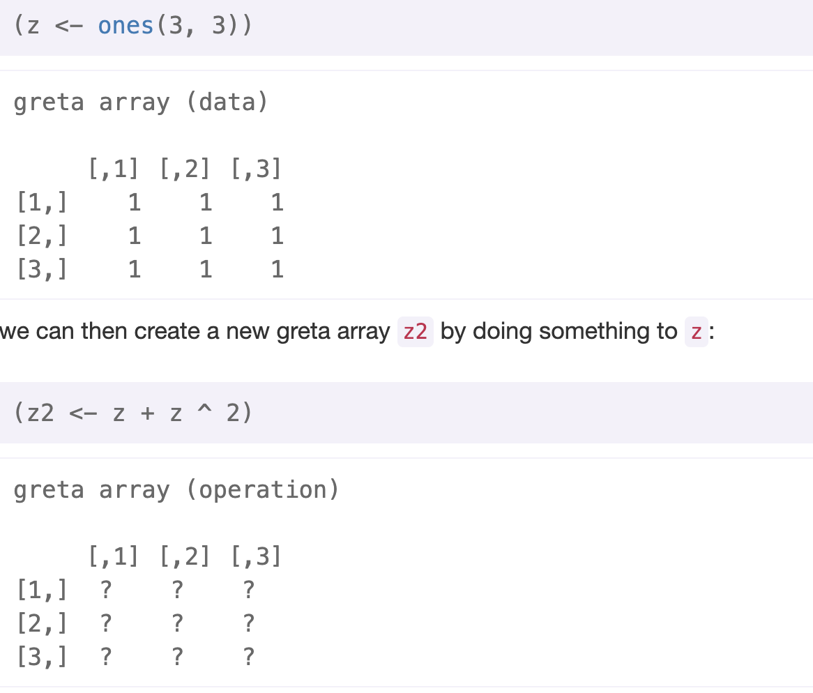
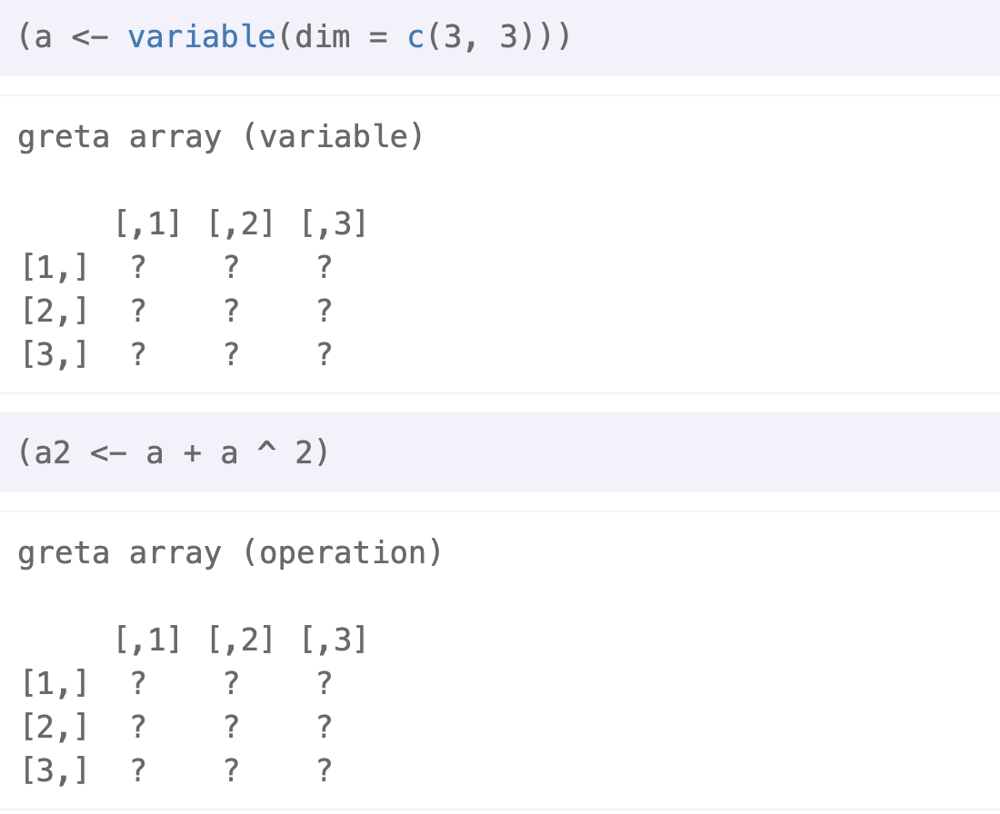
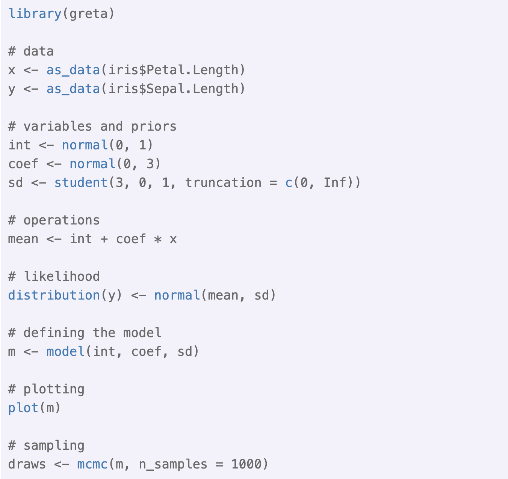
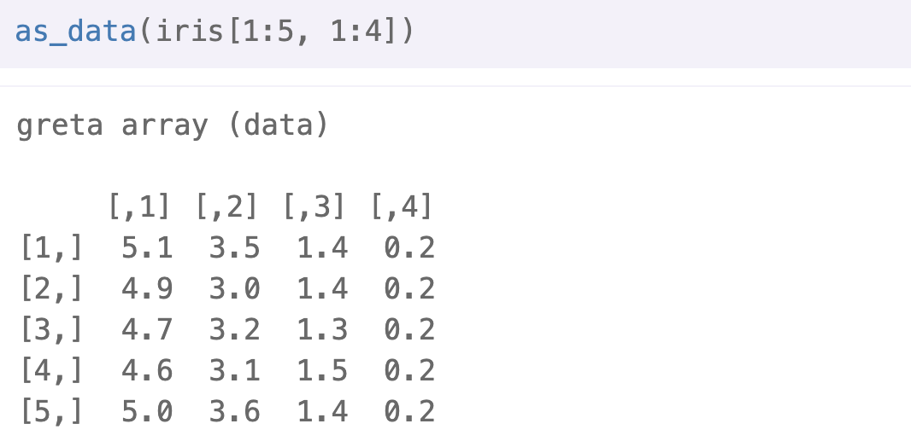
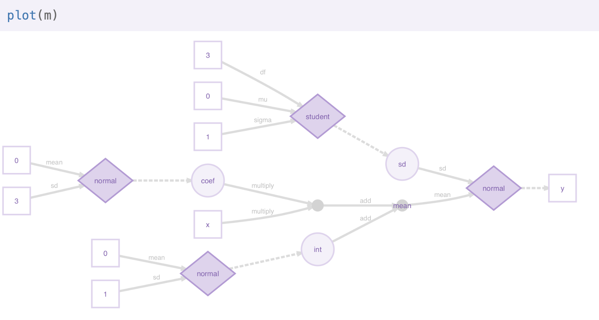
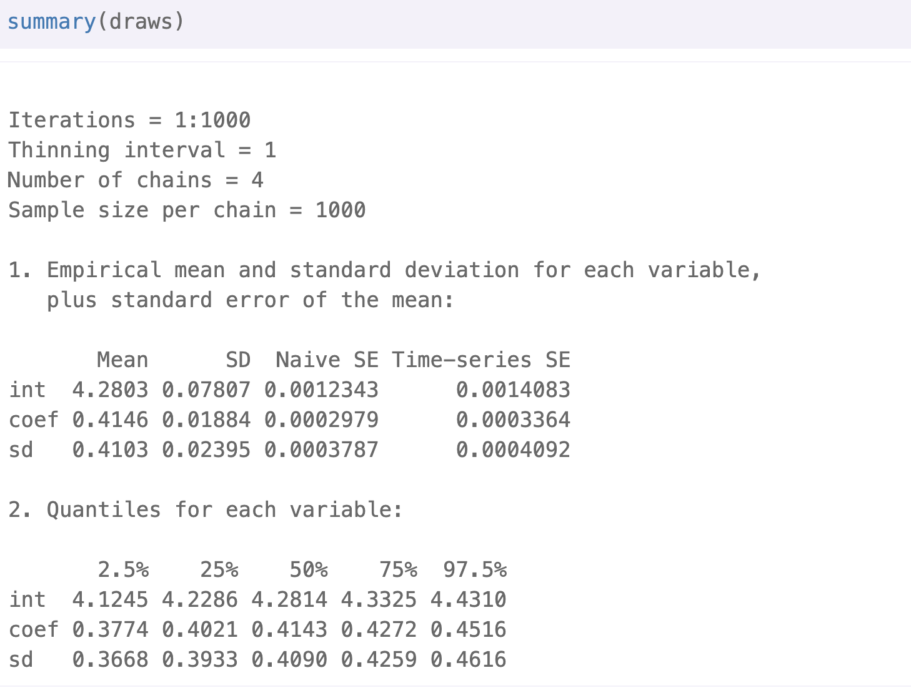
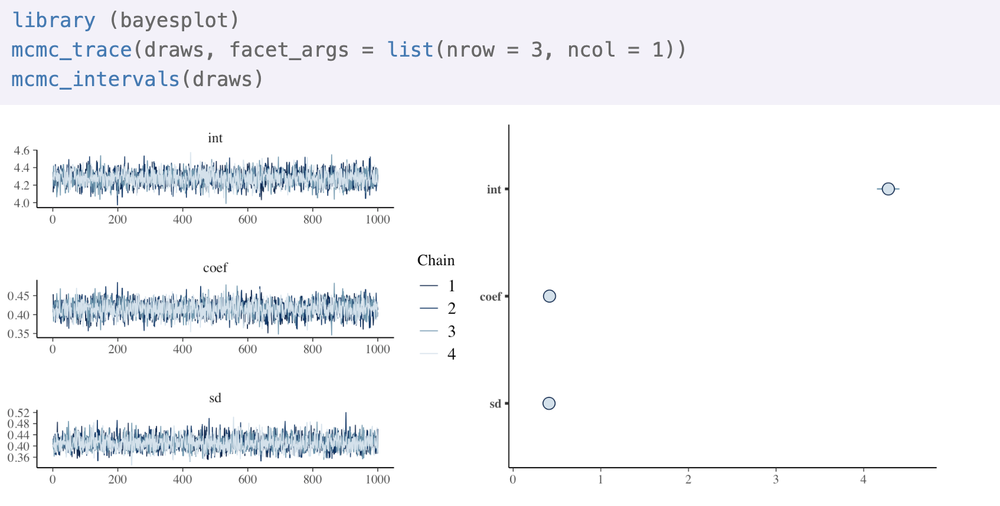

```{r setup, include=FALSE}
knitr::opts_chunk$set(echo = FALSE)
```

## [Bayesian Theorem](https://betterexplained.com/articles/an-intuitive-and-short-explanation-of-bayes-theorem/)
<font size="4"> Bayes' theorem is a fundamental theorem in Bayesian statistics, as it is used by Bayesian methods to update probabilities, which are degrees of belief, after obtaining new data. Given two events A and B, the conditional probability of A given that B is true is expressed as follows:</font>\

$$P(A|B) = \frac{P(B|A)*P(A)}{P(B)}$$

<font size="4"> <span style="color:green"> P(A) is the prior probability of A </span>which expresses one's beliefs about A before evidence is taken into account. The prior probability may also quantify prior knowledge or information about A. <span style="color:green"> P(B|A) is the likelihood function, which can be interpreted as the probability of the evidence B given that A is true.</span> The likelihood quantifies the extent to which the evidence B supports the proposition A. <span style="color:green"> P(A|B) is the posterior probability, the probability of the proposition A after taking the evidence B into account.</span>  Essentially, Bayes' theorem updates one's prior beliefs P(A) after considering the new evidence B </font>.


## [Bayesian Statistics and modeling](https://www.analyticsvidhya.com/blog/2016/06/bayesian-statistics-beginners-simple-english/)

“Bayesian statistics is a mathematical procedure that applies probabilities to statistical problems. It provides people the tools to update their beliefs in the evidence of new data.”\

A Bayesian model is a statistical model where you use probability to represent all uncertainty within the model, both the uncertainty regarding the output but also the uncertainty regarding the input (parameters) to the model. The whole prior/posterior/Bayes theorem thing follows on this. 

## greta -- simple and scalable statistical modelling in R

```{r, out.width='75%', out.length = '80%',fig.align='center'}

```

\center Source: https://greta-stats.org/  \center

## Installation

You can install the stable version of greta from CRAN:\

**install.packages("greta")**\

or the development version from GitHub using devtools:\

**devtools::install_github("greta-dev/greta")**\

then load the package\

**library(greta)**\

\center Source: https://greta-stats.org/

## Installation-- TransorFlow

Before you can fit models with greta, you will also need to have a working installation of Google’s TensorFlow python package (version 1.10.0 or higher) and the tensorflow-probability python package (version 0.3.0 or higher). greta exports **install_tensorflow()** from the tensorflow R package, which you can use to install the latest versions of these packages from within your R session. 

\center Source: https://greta-stats.org/

## Installation--DiagrammeR

Greta’s plotting functionality depends on the DiagrammeR package. Because DiagrammeR depends on the igraph package, which contains a large amount of code that needs to be compiled, DiagrammeR often takes a long time to install. So, DiagrammeR isn’t installed automatically with greta. If you want to plot greta models, you can install igraph and DiagrammeR from CRAN.\

**install.packages("igraph")**\
**install.packages("DiagrammeR")**\

\center Source: https://greta-stats.org/

## How greta works

Greta lets us build statistical models interactively in R, and then sample from them by MCMC. We build greta models with greta array objects, which behave much like R’s array, matrix and vector objects for numeric data. Like those numeric data objects, greta arrays can be manipulated with functions and mathematical operators to create new greta arrays.\

The key difference between greta arrays and numeric data objects is that when you do something to a greta array, greta doesn’t calculate the values of the new greta array. Instead, it just remembers what operation to do, and works out the size and shape of the result.\

\center Source: https://greta-stats.org/

## Create a greta array

```{r, out.width='65%', fig.align='center'}

```

\center Source: https://greta-stats.org/

## Construct models using greta arrays that represent unknown variables

```{r, out.width='50%', fig.align='center'}

```

Greta also lets us declare that a greta array follows a probability distribution, allowing us to train models using observed data, and to define prior distributions over our parameters, for Bayesian analyses.\

\center Source: https://greta-stats.org/

## Building a model

```{r, out.width='65%', fig.align='center'}

```

\center Source: https://greta-stats.org/

## Data

**x <- as_data(iris\$Petal.Length)**\
**y <- as_data(iris\$Sepal.Length)**\
The greta function as_data() converts other R objects into greta arrays.\

```{r, out.width='65%', fig.align='center'}

```

\center Source: https://greta-stats.org/

## Variables and priors

**int <- normal(0, 1)**\
**coef <- normal(0, 3)**\
**sd <- student(3, 0, 1, truncation = c(0, Inf))**\

Each of these is a variable greta array, and each is assumed a priori (before fitting to data) to follow a different probability distribution. In other words, these are prior distributions over variables, which we need to specify to make this a full Bayesian analysis. \

\center Source: https://greta-stats.org/

## Operations

Use mathematical operators to combine some of our parameters and data, to calculate the predicted sepal lengths, for a given parameter set.\

**mean <- int + coef * x**\

\center Source: https://greta-stats.org/

## Likelihood

By comparing the sepal lengths predicted under different parameter values with the observed sepal lengths, we can estimate the most plausible values of those parameters. \

**distribution(y) <- normal(mean, sd)**\

\center Source: https://greta-stats.org/

## Defining the model 

Now all of the greta arrays making up the model have been created, we need to combine them and set up the model so that we can sample from it, using model():\

**m <- model(int, coef, sd)**\

model() returns a ‘greta model’ object, which combines all of the greta arrays that make up the model. We can pass greta arrays as arguments to model() to flag them as the parameters we’re interested in. When sampling from the model with mcmc() those will be the greta arrays for which samples will be returned. Alternatively, we can run model() without passing any greta arrays, in which case all of the greta arrays (except for data greta arrays) in the working environment will be set as the targets for sampling instead.\

Source: https://greta-stats.org/

## Plotting

```{r, out.width='90%', fig.align='center'}

```


\center Source: https://greta-stats.org/

## Sampling
<font size="4">When defining the model, greta combines all of the distributions together to define the joint density of the model, a measure of how ‘good’ (or how probable if we’re being Bayesian) are a particular candidate set of values for the variables in the model.</font>\

<font size="4">Now we have a greta model that will give us the joint density for a candidate set of values, so we can use that to carry out inference on the model. We do that using an <span style="color:green">Markov chain Monte Carlo (MCMC) algorithm to sample values of the parameters</span> we’re interested in, using the mcmc() function:</font>\

**draws <- mcmc(m, n_samples = 1000)**\
<font size="4">Here we’re using 1000 steps of <span style="color:green">the static Hamiltonian Monte Carlo (HMC) algorithm</span> on each of 4 separate chains, giving us 4000 samples. HMC uses the gradients of the joint density to efficiently explore the set of parameters. By default, greta also spends 1000 iterations on each chain ‘warming up’ (tuning the sampler parameters) and ‘burning in’ (moving to the area of highest probability) the sampler.</font>\


\center Source: https://greta-stats.org/

## Summary

```{r, out.width='75%', fig.align='center'}

```

\center Source: https://greta-stats.org/

## Plotting

```{r, out.width='95%', fig.align='center'}

```

\center ource: https://greta-stats.org/


## More information

[Functions reference](https://greta-stats.org/reference/index.html)\
[Examples of different Bayesian Models](https://greta-stats.org/articles/example_models.html)\
[Real data anaylsis](https://greta-stats.org/articles/analyses/eight_schools.html)\


